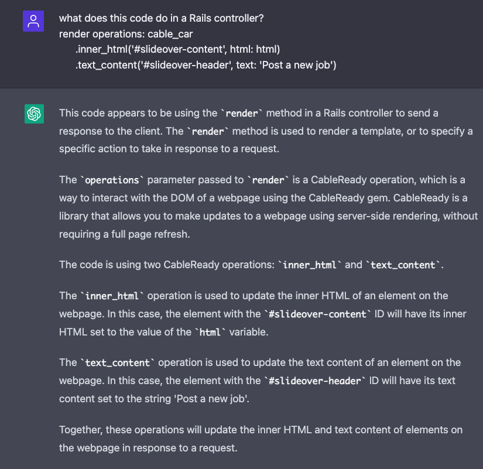

<!-- START doctoc generated TOC please keep comment here to allow auto update -->
<!-- DON'T EDIT THIS SECTION, INSTEAD RE-RUN doctoc TO UPDATE -->
**Table of Contents**  *generated with [DocToc](https://github.com/thlorenz/doctoc)*

- [README](#readme)
  - [References](#references)
  - [Chapter 1: Setup](#chapter-1-setup)
  - [Chapter 2](#chapter-2)
    - [Devise](#devise)
    - [Tailwind](#tailwind)
    - [Stimulus](#stimulus)
  - [Chapter 3: Job Postings](#chapter-3-job-postings)
    - [Creating jobs in a slideover](#creating-jobs-in-a-slideover)
    - [Creating job postings](#creating-job-postings)
    - [Slideover edit links](#slideover-edit-links)
    - [Deleting jobs](#deleting-jobs)
    - [Adding jobs with Turbo Streams](#adding-jobs-with-turbo-streams)
  - [My Questions and Comments](#my-questions-and-comments)

<!-- END doctoc generated TOC please keep comment here to allow auto update -->

# README

Learning Rails with the Hotwire stack, CableReady, and StimulusReflex with [this book](https://book.hotwiringrails.com/chapters). Github [repo](https://github.com/DavidColby/hotwired_ats_code).

```
docker-compose up
bin/rails db:create
bin/dev
```

## References

TODO: Go back over Chapter 1 and list every part of tech stack and what it's used for.

TODO: All form POST requests are automatically having header set `Accept: text/vnd.turbo-stream.html, text/html, application/xhtml+xml`, which makes Rails controller process request as turbo stream, eg: `Processing by JobsController#create as TURBO_STREAM`. Where is this configured to do so?

According to ChatGPT on turbo streams:

```
The "TURBO_STREAM" format is a way of streaming responses in Rails. It allows the server to send a response to the client in chunks, rather than waiting for the entire response to be generated before sending it. This can be useful for large responses or for responses that take a long time to generate, as it allows the client to start receiving and rendering the response before the entire response has been generated.

The line "Processing by JobsController#create as TURBO_STREAM" indicates that a request is being processed by the create action in the JobsController controller, and that the response will be sent using the "TURBO_STREAM" format.
```

According to ChatGPT on difference between Stimulus and StimulusReflex:

```
Stimulus is a JavaScript library for adding interactivity to your web application. It is designed to be lightweight and easy to use, and it allows you to add behaviors to your HTML elements using simple JavaScript classes.

StimulusReflex is an extension of Stimulus that adds real-time, server-side rendering to your application. It uses the ActionCable websocket framework to allow the server to push updates to the client without the need for the client to constantly poll the server for updates. This can be useful for building responsive, interactive applications without the need for complex client-side code.

One key difference between Stimulus and StimulusReflex is that Stimulus is focused on adding client-side behaviors to your application, while StimulusReflex adds real-time, server-side rendering capabilities. This means that Stimulus is primarily used for adding interactions and animations to your application, while StimulusReflex is used for updating the application's state and rendering new content in real-time.
```

* [StimulsReflex](https://docs.stimulusreflex.com/): extends capabilities of Rails and [Stimulus](https://stimulus.hotwired.dev/)
* [Mrujs](https://mrujs.com/)
  * [CableCar Plugin for Mrujs](https://mrujs.com/how-tos/integrate-cablecar) to make it easier to work with CableReady?
* [CableReady](https://cableready.stimulusreflex.com/)
  * [CableReady Operations](https://cableready.stimulusreflex.com/reference/operations)

## Chapter 1: Setup

Note project is using [Mrujs](https://mrujs.com/). Mrujs is intended as a direct replacement for `@rails/ujs`, which used to ship by default with Rails 6 but has since been deprecated.

## Chapter 2

### Devise

test1@example.com/123456

Add devise gem, with customizations to create `Account` model whenever a new `User` is registered.

```
bin/rails generate devise:views
bin/rails g devise User account:references first_name:string last_name:string
bin/rails g devise:controllers users -c=registrations
bin/rails g devise:controllers users -c=sessions
```

### Tailwind

Added a bunch of Tailwind stuff that isn't working, despite downgrading to same version as author's in `package.json`.

Had to comment out: `app/assets/stylesheets/forms.css`

Actually: Remove spaces between `hover` and `focus` and `:` fixes compilation errors.

### Stimulus

[Reference](https://stimulus.hotwired.dev/handbook/introduction)

[Regular Rails Flash Messages](https://www.rubyguides.com/2019/11/rails-flash-messages/)

> Stimulus is a JavaScript framework with modest ambitions. Unlike other front-end frameworks, Stimulus is designed to enhance static or server-rendered HTML—the “HTML you already have”—by connecting JavaScript objects to elements on the page using simple annotations.

Use Stimulus to display toast messages in the Rails `flash` hash.

See `app/javascript/controllers/alert_controller.js`. This gets connected to DOM in `app/views/shared/_flash.html.erb`

`<div data-controller="alert"...` tells Stimulus to instantiate a new instance of `AlertController` each time this HTML enters DOM.

`<button data-action="alert#close" ...` the [action](https://stimulus.hotwired.dev/reference/actions) attribute is how we trigger Stimulus methods based on user input. We can attach data-action attributes to any DOM element to listen for user interaction with the element as long as the element has a parent data-controller.

By default, Stimulus listens for `click` event for buttons. If wanted to listen for some other event such as `mouseup`:

```html
<button data-action="mouseup->alert#close">...</button>
```

Stimulus reference for [default events](https://stimulus.hotwired.dev/reference/actions#event-shorthand).

To get the flash partial `app/views/shared/_flash.html.erb` to render, update application layout `app/views/layouts/application.html.erb`:

```erb
<body>
  <div class="flex flex-col h-screen justify-between px-4 md:px-0">
    <main class="mb-auto w-full">
      <div class="mx-auto max-w-7xl">
        <%= yield %>
      </div>
    </main>
  </div>
  <div id="flash-container">
    <% flash.each do |key, value| %>
      <%= render "shared/flash", level: key, content: value %>
    <% end %>
  </div>
</body>
```

## Chapter 3: Job Postings

Standard Rails + [CableReady](https://cableready.stimulusreflex.com/) + a little Turbo Steams and Turbo Frames

> CableReady is a Ruby gem that lets you create great real-time user experiences by triggering client-side DOM changes, events and notifications over [ActionCable](https://guides.rubyonrails.org/action_cable_overview.html) web sockets. These commands are called operations.

A user of our ATS can create job postings that (later) applicants can apply to.

Use `scaffold` generator to create Job model, controller, and views:

```
rails g scaffold Job title:string status:string:index job_type:string:index location:string account:references
```

Use [ActionText](https://guides.rubyonrails.org/action_text_overview.html) to store job description rather than having longtext description column on jobs table directly.

```
rails action_text:install
bundle install
rails db:migrate
```

### Creating jobs in a slideover

Up until now, the jobs routes are all standard Rails. i.e. clicking on the new job link takes the user to a new page to fill out the job posting form. After they submit the form they are redirected to the job posting.

Goal: Open job form in a slideover drawer instead of navigating to a new page. When form submitted, newly created job should be added to the existing list of jobs and the slide over drawer should close.

Create new stimulus controller:

```
rails g stimulus slideover
```

Unlike with alert controller (when we used Stimulus in Chapter 2), this time using `targets`:

```javascript
// app/javascript/controllers/slideover_controller.js
export default class extends Controller {
  // https://stimulus.hotwired.dev/reference/targets
  // target can be referenced in controller with `this.slideoverTarget`
  // Targets are DOM elements that we set when we connect a controller to the DOM.
  // When working with Stimulus, targets are used to obtain a reference to a specific DOM element.
  static targets = [ "slideover" ]
  ...
}
```

The corresponding partial `app/views/shared/_slideover.html.erb` has:

```erb
<div data-slideover-target="slideover">
  <div>
    <h3 id="slideover-header"></h3>
    <button data-action="slideover#close" aria-label="Close slideover">
      <%= inline_svg_tag 'close.svg', class: "h-7 w-7 text-white" %>
    </button>
  </div>
  <div>
    <div id="slideover-content"></div>
  </div>
</div>
```

**Notes**

* `data-slideover-target="slideover"` connects the dom element that has this data attribute to the slideover controller.
* `data-action="slideover#close` on the button element. This means when the button is clicked, the `close` function in the slideover controller will be invoked.
* div with id of `slideover-content` is intentionally left empty. This "component" will be re-used throughout app with different content loaded each time. Same goes for header iwht id of `slideover-header`.

To ensure the slideover component gets rendered, add it to main application layout:

Note we had to add `data-controller="slideover"` to the body element! Is this ok because it's a component that applies to the app globally?

```erb
<!-- app/views/layouts/application.html.erb -->
<body data-controller="slideover">
  <div class="flex flex-col h-screen justify-between px-4 md:px-0">
    <%= render "nav/top_nav" %>
    <main class="mb-auto w-full overflow-auto">
      <div class="mx-auto max-w-7xl md:px-6 lg:px-8 py-8">
        <%= yield %>
      </div>
    </main>
    <%= render "shared/footer" %>
    <div id="flash-container">
      <% flash.each do |key, value| %>
        <%= render "shared/flash", level: key, content: value %>
      <% end %>
    </div>
  </div>
  <%= render "shared/slideover" %>
</body>
```

Next up we want the slideover to open when user clicks to create a new job. Earlier when we scaffolded the Jobs model, Rails generated `app/views/jobs/index.html.erb` with a create link like this:

```erb
<!-- app/views/jobs/index.html.erb -->
<%= link_to "Post a new job", new_job_path %>
```

Where `new_job_path` is defined at `/jobs/new`, handled by `app/controllers/jobs_controller.rb#new`.

Now let's change this link to add some data attributes:

```erb
<!-- app/views/jobs/index.html.erb -->
<%= link_to "Post a new job",
new_job_path,
class: "btn-primary-outline",
data: {
  action: "click->slideover#open",
  remote: true
} %>
```

Looking at the "Post a new job" link in browser, it generated this DOM:

```htm
<a class="btn-primary-outline" data-action="click->slideover#open" data-remote="true" href="/jobs/new" data-turbo="false">Post a new job</a>
```

**Notes**

* `data-action` tells Stimulus to fire `slideover#open` when the link is clicked.
* `data-remote` indicates that the link should be handled by [Mrujs' CableCar plugin](https://mrujs.com/how-tos/integrate-cablecar#examples). This means the link will expect CableCar JSON returned.
* Clicking the link will still invoke an http GET request to `new_job_path` on the Rails server. We're going to modify the new method in jobs controller to return the CableCar JSON expected by Mrujs.

Need to update `new` method in jobs controller to respond with expected JSON for CableCar.

Here is original `new` method generated by Rails scaffold, which by default, renders the `app/views/jobs/new.html.erb` view:

```ruby
# app/controllers/jobs_controller.rb
class JobsController < ApplicationController
  # ...

  # GET /jobs/new
  def new
    @job = Job.new
  end
  # ...
end
```

Here is the updated `new` method to work with CableCar:

```ruby
def new
  # render the jobs form partial (app/views/jobs/_form.html.erb) to a string
  html = render_to_string(partial: 'form', locals: { job: Job.new })

  # render cable_car operations which are sent back to the browser as a JSON payload that Mrujs handles.
  render operations: cable_car
    .inner_html('#slideover-content', html: html)
    .text_content('#slideover-header', text: 'Post a new job')
end
```

**Notes**

* Using CableReady through the CableCar plugin does not require WebSockets or ActionCable.
* Using CableCar and Mrujs keeps users in the normal request/response cycle, without involving WebSockets.
* User makes a request in their browser -> Rails responds to that request with JSON payload containing CableReady operations.
* Mrujs receives that response in the browser, then calls `cableReady.perform` which applies the operations sent from the server, no WebSockets required.
* CableReady has many operations but we're going to be using it to add, remove, and update DOM elements, as well as update data attributes in response to user actions.

Just for fun, here' is ChatGPT's explanation of the controller code:



In order to render `cable_car` operations from a Rails controller, need to include `CableReady::Broadcaster` in controller. But we're going to be doing this throughout app, so put it in main application controller:

```ruby
# app/controllers/application_controller.rb
class ApplicationController < ActionController::Base
  include CableReady::Broadcaster
end
```

This makes CableReady broadcast operations from server to browser, and browser processes these operations.

Left at "we can pause here to test that the slideover works as expected"

TODO: Paste in request as shown in Rails server and HTTP JSON response from browser dev tools.

Try the slideover from `http://localhost:3000/jobs` and click Post a job:

Browser submits GET request to Rails server. Notice `accept` header of `vnd.cable-ready.json`:

```
curl 'http://localhost:3000/jobs/new' \
-H 'Accept-Language: en-US,en;q=0.9' \
-H 'Connection: keep-alive' \
-H 'Cookie: __profilin=p%3Dt; _news_session=dma9Qz...' \
-H 'If-None-Match: W/"e70b236c3da9e7b86af8c229f9926147"' \
-H 'Referer: http://localhost:3000/jobs' \
-H 'Sec-Fetch-Dest: empty' \
-H 'Sec-Fetch-Mode: cors' \
-H 'Sec-Fetch-Site: same-origin' \
-H 'User-Agent: Mozilla...' \
-H 'accept: application/vnd.cable-ready.json, */*' \
-H 'x-requested-with: XmlHttpRequest' \
--compressed
```

Here's what it looks like when received on Rails server:

```
Started GET "/jobs/new" for ::1 at 2022-12-23 06:49:27 -0500
Processing by JobsController#new as CABLE_READY
User Load (9.0ms)  SELECT "users".* FROM "users" WHERE "users"."id" = ? ORDER BY "users"."id" ASC LIMIT ?  [["id", 1], ["LIMIT", 1]]
Rendered jobs/_form.html.erb (Duration: 91.7ms | Allocations: 6660)
Completed 200 OK in 225ms (Views: 1.9ms | ActiveRecord: 9.0ms | Allocations: 9432)
```

Here is the response received by browser from `http://localhost:3000/jobs/new`. Notice the content type of `vnd.cable-ready.json`

```
HTTP/1.1 200 OK
X-Frame-Options: SAMEORIGIN
X-XSS-Protection: 0
X-Content-Type-Options: nosniff
X-Download-Options: noopen
X-Permitted-Cross-Domain-Policies: none
Referrer-Policy: strict-origin-when-cross-origin
Content-Type: application/vnd.cable-ready.json; charset=utf-8
Vary: Accept
ETag: W/"e401f9d2a671c74860b85d83faa029eb"
Cache-Control: max-age=0, private, must-revalidate
Set-Cookie: _hotwired_ats_session=pGXVC9...; path=/; HttpOnly; SameSite=Lax
X-Request-Id: ebc73e4c-9d90-4b54-ab26-ec9864bed4e0
X-Runtime: 0.330878
Server-Timing: start_processing.action_controller;dur=0.56, sql.active_record;dur=37.23, instantiation.active_record;dur=1.02, render_partial.action_view;dur=91.96, process_action.action_controller;dur=225.21
Transfer-Encoding: chunked


[
    {
        "html": "<form action=\"/jobs\" accept-charset=\"UTF-8\" method=\"post\"><input type=\"hidden\" name=\"authenticity_token\" value=\"jaUH2AtxVN0dPnhRthfE9moJXYDEWLxBGqjF9hmMHB_MVDFCT7NbLnXrnarlRTapGO5_cx_7zRBj9qaTTi9EoQ\" autocomplete=\"off\" />\n\n  <div>\n    <label style=\"display: block\" for=\"job_title\">Title</label>\n    <input type=\"text\" name=\"job[title]\" id=\"job_title\" />\n  </div>\n\n  <div>\n    <label style=\"display: block\" for=\"job_status\">Status</label>\n    <input type=\"text\" value=\"open\" name=\"job[status]\" id=\"job_status\" />\n  </div>\n\n  <div>\n    <label style=\"display: block\" for=\"job_job_type\">Job type</label>\n    <input type=\"text\" value=\"full_time\" name=\"job[job_type]\" id=\"job_job_type\" />\n  </div>\n\n  <div>\n    <label style=\"display: block\" for=\"job_location\">Location</label>\n    <input type=\"text\" name=\"job[location]\" id=\"job_location\" />\n  </div>\n\n  <div>\n    <label style=\"display: block\" for=\"job_account_id\">Account</label>\n    <input type=\"text\" name=\"job[account_id]\" id=\"job_account_id\" />\n  </div>\n\n  <div>\n    <input type=\"submit\" name=\"commit\" value=\"Create Job\" data-disable-with=\"Create Job\" />\n  </div>\n</form>",
        "selector": "#slideover-content",
        "operation": "innerHtml"
    },
    {
        "text": "Post a new job",
        "selector": "#slideover-header",
        "operation": "textContent"
    }
]
```

Notice the response includes two operations: `innerHtml` and `textContent`. This is because of our code in jobs controller new method:

```ruby
render operations: cable_car
  .inner_html('#slideover-content', html: html)
  .text_content('#slideover-header', text: 'Post a new job')
```

So the `innerHtml` operation is used to set the inner html of `#slideover-content` with the rendered form partial.

And the `textContent` operation is used to set the text content of `#slideover-header` with text "Post a new job".

Let's make the form partial have human readable dropdown values for status and job type. Notice that job description is using the Trix editor for the rich text area:

```erb
<%= form_with(model: job, html: { class: "space-y-6" }) do |form| %>
  <% if job.errors.any? %>
    <div id="error_explanation">
      <h2><%= pluralize(job.errors.count, "error") %> prohibited this job from being saved:</h2>

      <ul>
        <% job.errors.each do |error| %>
          <li><%= error.full_message %></li>
        <% end %>
      </ul>
    </div>
  <% end %>

  <div class="form-group">
    <%= form.label :title %>
    <div class="mt-1">
      <%= form.text_field :title %>
    </div>
  </div>

  <div class="form-group">
    <%= form.rich_text_area :description %>
  </div>

  <div class="form-group">
    <%= form.label :status %>
    <%= form.select :status, options_for_select(Job.statuses.map{|key, _value| [key.humanize, key]}, job.status), {}, { class: "mt-1" } %>
  </div>

  <div class="form-group">
    <%= form.label :job_type %>
    <%= form.select :job_type, options_for_select(Job.job_types.map{|key, _value| [key.humanize, key]}, job.job_type), {}, { class: "mt-1" } %>
  </div>

  <div class="form-group">
    <%= form.label :location %>
    <div class="mt-1">
      <%= form.text_field :location %>
    </div>
  </div>

  <%= form.submit 'Submit', class: 'btn-primary float-right' %>
<% end %>
```

To make the trix editor look better, modified `app/assets/stylesheets/actiontext.css` as follows:

```css
@import "trix/dist/trix";

.trix-button--icon-increase-nesting-level,
.trix-button--icon-decrease-nesting-level,
.trix-button--icon-strike,
.trix-button--icon-code,
.trix-button-group.trix-button-group--file-tools {
  display: none;
}

trix-editor.trix-content {
  @apply appearance-none w-full max-w-prose bg-white text-gray-700 border-gray-200 rounded-sm text-lg focus:ring-1 focus:ring-blue-300 focus:border-blue-300;
  min-height: 400px;
}
```

Currently when the Job form is submitted from open slideover, user redirected to new page `http://localhost:3000/jobs/2`. This is because clicking Submit button from `app/views/jobs/_form.html.erb` submits http POST to `/jobs` endpoint which is handled by `JobsController#create` which redirects to the newly created job show page if the save is successful:

```ruby
# app/controllers/jobs_controller.rb
def create
  @job = Job.new(job_params)
  @job.account = current_user.account

  respond_to do |format|
    if @job.save
      format.html { redirect_to job_url(@job), notice: "Job was successfully created." }
      format.json { render :show, status: :created, location: @job }
    else
      format.html { render :new, status: :unprocessable_entity }
      format.json { render json: @job.errors, status: :unprocessable_entity }
    end
  end
end
```

### Creating job postings

Let's update things so the user remains on the jobs index page `http://localhost:3000/jobs` that shows all jobs, but with an updated listing so the newly created job gets added to the list, *without* a full page refresh.

Solution will be to use CableReady to close the slideover, and insert new job into existing list of jobs.

Update `create` method in jobs controller to render CableReady operations:

```ruby
def create
  @job = Job.new(job_params)
  @job.account = current_user.account
  if @job.save
    html = render_to_string(partial: 'job', locals: { job: @job })
    render operations: cable_car
      .prepend('#jobs', html: html)
      .dispatch_event(name: 'submit:success')
  else
    html = render_to_string(partial: 'form', locals: { job: @job })
    render operations: cable_car
      .inner_html('#job-form', html: html), status: :unprocessable_entity
  end
end
```

For the success case:
* Render the `app/views/jobs/_job.html.erb` partial and [prepend](https://developer.mozilla.org/en-US/docs/Web/API/Element/prepend) it to DOM element `#jobs` (where is this defined?).
* Also [dispatch a custom DOM event](https://cableready.stimulusreflex.com/reference/operations/event-dispatch#dispatch_event) `submit:success` which will be used by the slideover controller to close itself.

Recall the `open` function in the slideover controller (stimulus), listens for this event to close itself:

```javascript
// app/javascript/controllers/slideover_controller.js
open() {
  this.visible = true
  document.body.insertAdjacentHTML('beforeend', this.backgroundHtml)
  this.background = document.querySelector(`#slideover-background`)
  this.toggleSlideover()

  // This event listener, submit:success, is how we close the drawer after a successful form submission.
  document.addEventListener("submit:success", () => {
    this.close()
  }, { once: true })
}
```

Note that it's also possible to do this (server broadcasts event to be handled by client side javascript controller) with TurboStreams but its easier and more flexible to do with CableReady.

For failure case, we re-render the job form partial `app/views/jobs/_form.html.erb` with the job instance, which will now contain model errors, which will be displayed in forms. Then replace inner html of the `#job-form` DOM element with this partial, also sending http status `:unprocessable_entity`.

Also in order to process the rich text job field `description`, add it to allowed params in jobs controller:

```ruby
# app/controllers/jobs_controller.rb
def job_params
  params.require(:job).permit(:title, :status, :job_type, :location, :account_id, :description)
end
```

Update job form partial to add `data-remote` attribute (as we did earlier on new job link), and also specify `job-form` as the ID of the form element. This DOM id is needed for the job create error case to render: `.inner_html('#job-form', html: html), status: :unprocessable_entity`:

```erb
<!-- app/views/jobs/_form.html.erb -->
<%= form_with(
  model: job,
  id: 'job-form',
  html: { class: "space-y-6" },
  data: { remote: true }
) do |form| %>
<!-- ... rest of form ... -->
```

Add `#jobs` DOM id to the job container div in jobs index view. This is so the success case will be able to prepend a job job to the list `.prepend('#jobs', html: html)`:

```erb
<div class="divide-y divide-gray-200" id="jobs">
  <%= render @jobs %>
</div>
```

### Slideover edit links

Update edit link in job partial with data-action to tell it to open the slideover, and remote attribute so it will accept CableReady JSON:

```ruby
# app/views/jobs/_job.html.erb
<%= link_to job.title,
edit_job_path(job),
class: "text-lg text-blue-600 hover:text-blue-700",
data: {
  action: "click->slideover#open",
  remote: true
} %>
```

The `edit_job_path` is standard Rails, which will invoke the `edit` method in the jobs controller. Currently the edit method has default Rails behaviour which is to render the view `app/views/jobs/edit.html.erb` in a new page:

```ruby
# app/controllers/jobs_controller.rb
# GET /jobs/1/edit
def edit
end
```

Update `edit` method so that it instead uses CableReady operations to update slideover content with rendered job form partial, this time with a job instance so that the form will be pre-populated with that job's details:

```ruby
# app/controllers/jobs_controller.rb
def edit
  html = render_to_string(partial: 'form', locals: { job: @job })
  render operations: cable_car
    .inner_html('#slideover-content', html: html)
    .text_content('#slideover-header', text: 'Update job')
end
```

Note that `@job` instance var is populated in controller's `before_action`.

Also need to update the `update` method in controller to [replace](https://cableready.stimulusreflex.com/reference/operations/dom-mutations#replace) the current job in the DOM. Note use of `dom_id(@job)` to select the correct DOM element to be replaced:

```ruby
# app/controllers/jobs_controller.rb
def update
  if @job.update(job_params)
    html = render_to_string(partial: 'job', locals: { job: @job })
    render operations: cable_car
      .replace(dom_id(@job), html: html)
      .dispatch_event(name: 'submit:success')
  else
    html = render_to_string(partial: 'form', locals: { job: @job })
    render operations: cable_car
      .inner_html('#job-form', html: html), status: :unprocessable_entity
  end
end
```

### Deleting jobs

Update delete link in job partial  to add `remote` attribute to make it accept/receive CableReady JSON. No need for `data-action` because we don't need to open/close slideover drawer for delete action:

```erb
<!-- app/views/jobs/_job.html.erb -->
<%= button_to "Delete job",
job_path(job),
method: :delete,
class: "btn border border-red-200 hover:bg-red-100 text-sm text-red-700",
remote: true,
data: {
  confirm: "Are you sure?"
} %>
```

Calling clicking button to `job_path` with `method: :delete` invokes `destroy` method in jobs controller. Update this method to render CableReady [remove](https://cableready.stimulusreflex.com/reference/operations/dom-mutations#remove) operation to remove the DOM element identified by `dom_id(@job)`:

```ruby
# app/controllers/jobs_controller.rb
def destroy
  @job.destroy
  render operations: cable_car.remove(selector: dom_id(@job))
end
```

### Adding jobs with Turbo Streams

So far, have used Stimulus/StimulusReflex, CableReady and Mrujs to open/close slideover, populate it with content and process form submissions.

Another way to achieve this is with Stimulus, Turbo Streams, and Turbo Frames. Do this in a separate branch...

Author says CableReady more flexible for complex situations.

```ruby
# app/controllers/jobs_controller.rb
def new
  @job = Job.new
end

def create
  @job = Job.new(job_params)
  @job.account = current_user.account
  if @job.save
    render turbo_stream: turbo_stream.prepend(
      'jobs',
      partial: 'job',
      locals: { job: @job }
    )
  else
    render turbo_stream: turbo_stream.replace(
      'job-form',
      partial: 'form',
      locals: { job: @job }
    ), status: :unprocessable_entity
  end
end
```

**Notes**

* `new` action is simple because will beusing Turbo Frame in the new action to replace slideover content instead of broadcasting CableReady op to update DOM.
* `create` responds with Turbo Stream `prepend`, similar to CableReady `prepend` operation. Powered by [TurboStreamsTagBuilder](https://github.com/hotwired/turbo-rails/blob/main/app/controllers/turbo/streams/turbo_streams_tag_builder.rb) from `turbo-rails` gem.
* Turbo Streams support [seven actions](https://turbo.hotwired.dev/reference/streams): prepend, replace, append, update, remove, before, after.
* Can render multiple Turbo Streams in a single response - can do fancy page updates where multiple different areas of the page are being updated at once.

Explanation of `render turbo_stream:...` code from ChatGPT:

This code is using the render method in Rails to render a partial template called "job" and insert it at the beginning of an element with the ID "jobs" using Turbo Streams.

The render method is used to render a template or partial and return the resulting HTML as a string. In this case, the render method is being called with the turbo_stream option, which tells Rails to use Turbo Streams to update the DOM in real-time.

The prepend method is a method of the TurboStream object that inserts a new element at the beginning of the element with the specified ID. The partial option specifies the name of the partial template to render, and the locals option specifies a hash of local variables that should be available to the partial template. In this case, the job local variable is being passed to the partial template and can be accessed within the template using the job variable.

Overall, this code is using Turbo Streams to insert a new element at the beginning of the "jobs" element, using the rendered HTML from the "job" partial template and passing in the @job instance variable as a local variable to the template. This allows you to update the DOM in real-time and add new elements to the page without needing to refresh the page.

Back to book:

Unlike CableReady, Turbo Stream response cannot dispatch DOM event. Need to update Slideover Stimulus controller to close drawer after form is submitted:

```javascript
import { Controller } from 'stimulus'

export default class extends Controller {
  static targets = [ "slideover", "form" ]

  connect() {
    this.backgroundHtml = this.backgroundHTML()
    this.visible = false
  }

  disconnect() {
    if (this.visible) {
      this.close()
    }
  }

  open() {
    this.visible = true
    document.body.insertAdjacentHTML('beforeend', this.backgroundHtml)
    this.background = document.querySelector(`#slideover-background`)
    this.toggleSlideover()
  }

  close() {
    this.visible = false
    this.toggleSlideover()
    if (this.background) {
      this.background.classList.remove("opacity-100")
      this.background.classList.add("opacity-0")
      setTimeout(() => {
        this.background.remove()
      }, 500);
    }
  }

  toggleSlideover() {
    this.slideoverTarget.classList.toggle("right-0")
    this.slideoverTarget.classList.toggle("-right-full")
    this.slideoverTarget.classList.toggle("lg:-right-1/3")
  }

  backgroundHTML() {
    return `<div id="slideover-background" class="fixed top-0 left-0 w-full h-full z-20"></div>`;
  }

  handleResponse({ detail: { success } }) {
    if (success) {
      this.formTarget.reset()
      this.close()
    }
  }
}
```

Differences from before:

* Added `form` target
* Removed event listener from `open` function
* Added new function `handleResponse`
* `this.formTarget.reset()` is to avoid flash of old content when creating multiple jobs and closing the slideover

Update slideover partial:

```erb
<!-- app/views/shared/_slideover.html.erb -->
<%= turbo_frame_tag(
  "slideover",
  data: {
    slideover_target: "slideover",
    action: "turbo:submit-end->slideover#handleResponse"
  },
  class: "h-screen overflow-y-scroll fixed -right-full lg:-right-1/3 top-0 flex-1 flex flex-col w-full lg:w-1/3 bg-gray-100 transition-all duration-500 z-50"
) %>
```

**Notes**

* Slideover partial starts off as an empty `<turbo-frame>` element.
* When want to use the slideover, will render a view with a matching `turbo-frame id="slideover"`.
* Turbo will replace content of the slideover frame with updated content from the server
* `data-action` is listening for the `turbo:submit-end` [event](https://turbo.hotwired.dev/reference/events) (Stimulus not limited to handling just `click` events). When submit-end event is received, will invoke `handleResponse` function in slideover controller which will close the drawer if form was successful.

In order to see the new job form render in the slideover, update the new template:

```erb
<!-- app/views/jobs/new.html.erb -->
<%= turbo_frame_tag "slideover" do %>
  <div class="flex px-6 justify-between items-baseline bg-gray-900">
    <h3 class="text-xl text-white" id="slideover-header">Add a new job posting</h3>
    <button data-action="slideover#close" class="flex items-center justify-center h-12 w-12 rounded-full focus:outline-none focus:bg-gray-600 hover:bg-gray-600" aria-label="Close slideover">
      <%= inline_svg_tag 'close.svg', class: "h-7 w-7 text-white" %>
    </button>
  </div>
  <div class="mt-4 px-4 text-gray-700">
    <div id="slideover-content">
      <%= render "form", job: @job %>
    </div>
  </div>
<% end %>
```

**Notes**

* Above creates a matching `slideover` turo frame, together with full structure of slideover (before this was in the slideover partial).
* Turbo Frames replaces the entire content of the frame, therefore need the `new job` view to render everything (with CableReady we could do a more targetted replacement).

On jobs index view, update the Post a new job link:

```erb
<!-- app/views/jobs/index.html.erb -->
<%= link_to "Post a job",
new_job_path,
class: "btn-primary-outline",
data: {
  action: "click->slideover#open",
  turbo_frame: 'slideover'
} %>
```

Update job form to set `slideover_target` and remove data-remote. This is how Stimulus can reset the form after successful submission (recall `formTarget.reset()` in slideover controller):

```erb
<!-- app/views/jobs/_form.html.erb -->
<%= form_with(
  model: job,
  id: 'job-form',
  html: { class: "space-y-6" },
  data: {
    slideover_target: "form"
  }
) do |form| %>
...
```

**Notes**

* Removed `remote` attribute.
* Added `turbo_frame` attribute
* The goal is to have the response to the GET request from `/jobs/new` update the content of the `slideover` turbo frame, need to specify the turbo_frame [target](https://turbo.hotwired.dev/reference/frames#frame-with-overwritten-navigation-targets) on the link.
* The `turbo_frame` data attribute on the link is how Turbo connects everything.

The `form_with` will render a form element in the DOM as follows:

```html
<form id="job-form" data-slideover-target="form" action="/jobs" method="post">
  <!-- ... -->
</form
```

ChatGPT on difference between approaches:

```
Turbo Streams and CableReady with StimulusReflex are both tools that can be used to build interactive, real-time applications in Rails. However, they work in slightly different ways and have different use cases.

Turbo Streams is a feature of Rails 6 that allows you to update the DOM in real-time using a combination of server-side rendering and client-side JavaScript. It works by sending small, incremental updates to the client over a websocket connection, which are then applied to the DOM using JavaScript. Turbo Streams uses a technique called "incremental rendering" to update the DOM efficiently and minimize the amount of data that needs to be transferred over the network.

CableReady with StimulusReflex, on the other hand, is a combination of two libraries that can be used to add real-time, server-side rendering to your Rails application. CableReady is a JavaScript library that allows you to send commands to the server over a websocket connection, while StimulusReflex is a library that adds real-time, server-side rendering capabilities to Stimulus, a JavaScript library for adding interactivity to your application.

In general, Turbo Streams is a more streamlined and efficient way to build real-time applications in Rails, as it is built into the framework and uses incremental rendering to minimize data transfer. CableReady with StimulusReflex is a more flexible and customizable option, but it may require more setup and configuration to get it working.
```

## My Questions and Comments

1. Original `forms.css` from Chapter 1 has some syntax errors - space between hover and focus and `:` was causing Tailwind to not compile and breaking site styles. Solution is to remove extra spaces, so `hover:...` instead of `hover :...`
2. Having lots of utility classes in erb templates makes it difficult to also notice all the `data...` attributes that are used for reactivity with Stimulus, CableCar etc. This could make it challenging for a new developer joining a project to quickly scan the templates to determine which portions are controlled by what Stimulus controllers.
3. The flash partial `app/views/shared/_flash.html.erb` is connected to the Stimulus alert controller `app/javascript/controllers/alert_controller.js` via `<div data-controller="alert"...` Is there a naming convention similar to Rails controllers and views? Eg: Should the controller be named `flash_controller` to match the template name?
5. Is it considered good practice to make a Stimulus controller globally available via `<body data-controller="slideover">` in `app/views/layouts/application.html.erb`?
   1. Could this cause confusion when any template or partial anywhere in the app could reference functions in the slideover controller but any developer that didn't add the global might not know where this is defined?
   2. Could this cause the slideover controller to become a "dumping ground" for any other js functions that need to get executed anywhere in the app?
6. The slideover Stimuls controller `app/javascript/controllers/slideover_controller.js` has a function `backgroundHTML` that returns some markup. Is this considered good practice to mix logic and markup in a Stimulus controller? i.e. what should be the concerns of a Stimuls controller?
7. Seeing error in Rails server output `ActionController::RoutingError (No route matches [GET] "/assets/application.js-2f5ffb65c42075102a7a135fbe646944950943ded66c4ae0aeebbf43ff329d26.map")`. Missing source map?
8. Seeing warning in build/dev output when added animation css `No utilities were generated there is likely a problem with the `content` key in the tailwind config. For more information see the documentation: https://tailwindcss.com/docs/content-configuration`
9. When rendering a CableCar JSON response from a Rails controller such as `.inner_html('#slideover-content', html: html)`, what's the scope of the DOM that will be searched for finding the given selector? i.e. will it match the first `#slideover-content` found *anywhere* in the DOM? Or only the element that is located within the partial `app/views/shared/_slideover.html.erb`? The CableReady doc for [inner_html](https://cableready.stimulusreflex.com/reference/operations/dom-mutations#inner_html) doesn't explain or even have a DOM selector.
   1. Maybe this is the answer from CableReady [usage](https://cableready.stimulusreflex.com/usage): "By default, the selector option provided to DOM-mutating operations expects a CSS selector that resolves to one single DOM element. If multiple elements are returned, only the first one is used."
   2. If it's not scoped to the partial, this could get tricky as the project grows, another developer working on a different feature may add a DOM element by chance that has the same name, and then the wrong element would get updated, breaking this feature.
