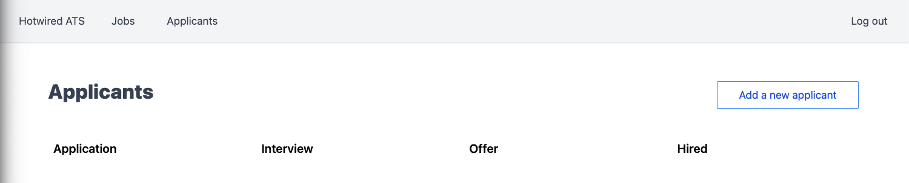
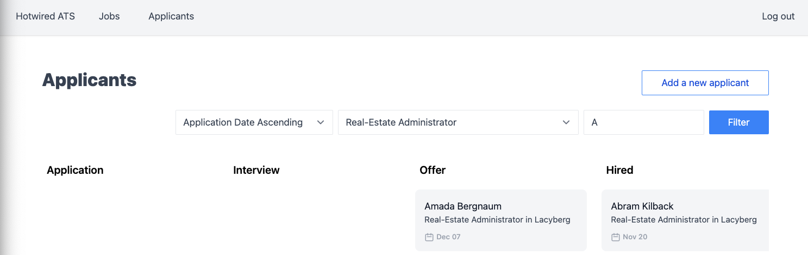

<!-- START doctoc generated TOC please keep comment here to allow auto update -->
<!-- DON'T EDIT THIS SECTION, INSTEAD RE-RUN doctoc TO UPDATE -->
**Table of Contents**  *generated with [DocToc](https://github.com/thlorenz/doctoc)*

- [README](#readme)
  - [Chapter 1](#chapter-1)
    - [The Stack](#the-stack)
    - [Creating a Rails application with rails new](#creating-a-rails-application-with-rails-new)
    - [Configure Tailwind](#configure-tailwind)
    - [Update esbuild config](#update-esbuild-config)
    - [Update bin/dev Scripts](#update-bindev-scripts)
    - [Install CableReady, StimulusReflex, and Mrujs](#install-cableready-stimulusreflex-and-mrujs)
  - [Chapter 2](#chapter-2)
    - [Users and accounts with Devise](#users-and-accounts-with-devise)
    - [Tailwind](#tailwind)
    - [Stimulus](#stimulus)
  - [Chapter 3: Job Postings](#chapter-3-job-postings)
    - [Creating jobs in a slideover](#creating-jobs-in-a-slideover)
    - [Creating job postings](#creating-job-postings)
    - [Slideover edit links](#slideover-edit-links)
    - [Deleting jobs](#deleting-jobs)
    - [Adding jobs with Turbo Streams](#adding-jobs-with-turbo-streams)
  - [Chapter 4: Creating and moving applicants](#chapter-4-creating-and-moving-applicants)
    - [Build applicant resource](#build-applicant-resource)
    - [Create applicants](#create-applicants)
    - [ActiveStorage resumes](#activestorage-resumes)
      - [Performance](#performance)
    - [Drag applicants between stages](#drag-applicants-between-stages)
      - [Dragging applicants with Stimulus](#dragging-applicants-with-stimulus)
      - [Sidebar: Drag-and-drop with StimulusReflex](#sidebar-drag-and-drop-with-stimulusreflex)
  - [Chapter 5 Filtering and sorting with Turbo Frames](#chapter-5-filtering-and-sorting-with-turbo-frames)
    - [Add filtering and sorting UI](#add-filtering-and-sorting-ui)
    - [Add text search with PgSearch](#add-text-search-with-pgsearch)
    - [Add filterable concern](#add-filterable-concern)
    - [Use Kredis to get and set filters](#use-kredis-to-get-and-set-filters)
    - [Clean up applicant group queries](#clean-up-applicant-group-queries)
    - [Apply filters with Turbo Frames](#apply-filters-with-turbo-frames)
    - [Automatic form submission with Stimulus](#automatic-form-submission-with-stimulus)
    - [Cleaning up the filter form](#cleaning-up-the-filter-form)
    - [Filtering jobs](#filtering-jobs)
  - [My Questions and Comments](#my-questions-and-comments)

<!-- END doctoc generated TOC please keep comment here to allow auto update -->

# README

Learning Rails with the Hotwire stack, CableReady, and StimulusReflex with [this book](https://book.hotwiringrails.com/chapters). Github [repo](https://github.com/DavidColby/hotwired_ats_code).

```
docker-compose up
bin/rails db:create
bin/rails db:seed
bin/dev
```

Connect to Postgres in Docker:

```
psql -h 127.0.0.1 -p 5435 -U hotwired_ats
```

Connect to [Redis](https://redis.io/docs/getting-started/installation/install-redis-on-mac-os/) in Docker:

```
redis-cli -h 127.0.0.1 -p 6380
```

## Chapter 1

### The Stack

* [esbuild](https://esbuild.github.io/) for bundling JS. Will configure to auto refresh browser as changes are made to any JS or CSS.
  * [chokidar](https://github.com/paulmillr/chokidar) Minimal and efficient cross-platform file watching library.
* [Tailwind](https://tailwindcss.com/) and postcss for styling.
  * [postcss-import](https://www.npmjs.com/package/postcss-import) npm/yarn module, PostCSS plugin to transform @import rules by inlining content.
  * [tailwindcss-forms](https://github.com/tailwindlabs/tailwindcss-forms) Tailwind plugin that provides a basic reset for form styles that makes form elements easy to override with utilities.
* [Hotwire stack](https://hotwired.dev/) for faster page loads:
  * [Turbo Drive](https://turbo.hotwired.dev/handbook/drive) watches for link clicks and form submissions and performs them in the background, then updates the page without doing a full reload. Evolution of `turbolinks` gem.
  * [Turbo Frames](https://turbo.hotwired.dev/handbook/frames) for partial page updates. Any links and forms inside a frame are captured, and the frame contents automatically updated after receiving a response. Regardless of whether the server provides a full document, or just a fragment containing an updated version of the requested frame, only that particular frame will be extracted from the response to replace the existing content
  * [Turbo Streams](https://turbo.hotwired.dev/handbook/streams) for reactive page updates. Delivers page changes as fragments of HTML wrapped in self-executing `<turbo-stream>` elements. Each stream element specifies an action together with a target ID to declare what should happen to the HTML inside it. These elements are delivered by the server over a WebSocket, [SSE](https://developer.mozilla.org/en-US/docs/Web/API/Server-sent_events/Using_server-sent_events) or other transport to bring the application alive with updates made by other users or processes.
  * [Stimulus](https://stimulus.hotwired.dev/handbook/introduction) for front end interactivity. Enhances static or server-rendered HTML—the “HTML you already have”—by connecting JavaScript objects to elements on the page using simple annotations.
    * [Callbacks](https://stimulus.hotwired.dev/reference/lifecycle-callbacks)
    * [Values](https://stimulus.hotwired.dev/reference/values)
* [CableReady](https://cableready.stimulusreflex.com/) further server-powered frontend interactivity and reactive page updates. Triggers client-side DOM changes, events and notifications over ActionCable web sockets. These commands are called [operations](https://cableready.stimulusreflex.com/reference/operations). CableReady is the primary dependency powering StimulusReflex (see below). Establishes a standard for programmatically updating browser state with no need for custom JavaScript.
* [StimulusReflex](https://docs.stimulusreflex.com/) works together with CableReady. Extends the capabilities of both Rails and Stimulus by intercepting user interactions and passing them to Rails over real-time websockets. These interactions are processed by Reflex actions that change application state. The current page is quickly re-rendered and the changes are sent to the client using CableReady. The page is then [morphed](https://github.com/patrick-steele-idem/morphdom) to reflect the new application state. This entire round-trip allows us to update the UI in 20-30ms without flicker or expensive page loads.
* [mrujs](https://mrujs.com/) Sprinkle interactivity into your HTML elements using data attributes. A replacement for `@rails/ujs`, which used to ship by default with Rails 6 but has since been deprecated.
  * [fetch](https://mrujs.com/references/fetch)
* [CableCar](https://cableready.stimulusreflex.com/v/v5/cable-car) An Mrujs [plugin](https://mrujs.com/how-tos/integrate-cablecar) for use with CableReady's JSON serializer. CableReady was originally created to only work over ActionCable (aka websockets). With CableCar, operation queueing can also work over Ajax.
* [SortableJS](https://sortablejs.github.io/Sortable/) JavaScript library for reorderable drag-and-drop lists.

All form POST requests are automatically having header set `Accept: text/vnd.turbo-stream.html, text/html, application/xhtml+xml`, which makes Rails controller process request as turbo stream, eg: `Processing by JobsController#create as TURBO_STREAM`. Where is this configured to do so?

According to ChatGPT on turbo streams:

> The "TURBO_STREAM" format is a way of streaming responses in Rails. It allows the server to send a response to the client in chunks, rather than waiting for the entire response to be generated before sending it. This can be useful for large responses or for responses that take a long time to generate, as it allows the client to start receiving and rendering the response before the entire response has been generated.

> The line "Processing by JobsController#create as TURBO_STREAM" indicates that a request is being processed by the create action in the JobsController controller, and that the response will be sent using the "TURBO_STREAM" format.

According to ChatGPT on difference between Stimulus and StimulusReflex:

> Stimulus is a JavaScript library for adding interactivity to your web application. It is designed to be lightweight and easy to use, and it allows you to add behaviors to your HTML elements using simple JavaScript classes.

> StimulusReflex is an extension of Stimulus that adds real-time, server-side rendering to your application. It uses the ActionCable websocket framework to allow the server to push updates to the client without the need for the client to constantly poll the server for updates. This can be useful for building responsive, interactive applications without the need for complex client-side code.

> One key difference between Stimulus and StimulusReflex is that Stimulus is focused on adding client-side behaviors to your application, while StimulusReflex adds real-time, server-side rendering capabilities. This means that Stimulus is primarily used for adding interactions and animations to your application, while StimulusReflex is used for updating the application's state and rendering new content in real-time.

### Creating a Rails application with rails new

Specify tailwind for css and esbuild for javascript handling. `-T` skips tests as we won't be focusing on that in this book:

```
rails new hotwired_ats -T --css=tailwind --javascript=esbuild
cd hotwired_ats
rails db:create
```

### Configure Tailwind

[cssbundling-rails](https://github.com/rails/cssbundling-rails) gem doesn't support importing other css files into [app/assets/stylesheets/application.tailwind.css](app/assets/stylesheets/application.tailwind.css). Fix with some additional install and config:

```
yarn add postcss-import
touch postcss.config.js
```

```javascript
// postcss.config.js
module.exports = {
  plugins: [
    require('postcss-import'),
    require('tailwindcss'),
    require('autoprefixer')
  ]
}
```

```css
/* app/assets/stylesheets/application.tailwind.css */
@import "tailwindcss/base";
@import "tailwindcss/components";
@import "tailwindcss/utilities";
```

### Update esbuild config

[jsbundling-rails]([https://github.com/rails/jsbundling-rails]) gem sets up extremely simple esbuild config, but will almost always need to customize it.

Our custom config should do the following:

* Enable source maps in dev and prod.
* Minify bundle in prod.
* Auto rebuild/refresh page when assets and view files change.

Install [chokidar](https://github.com/paulmillr/chokidar) for file watching and auto refresh, then configure esbuild:

```
yarn add chokidar -D
touch esbuild.config.js
```

```javascript
// esbuild.config.js
#!/usr/bin/env node

const esbuild = require('esbuild')
const path = require('path')

// Add more entrypoints, if needed
const entryPoints = [
  "application.js",
]
const watchDirectories = [
  "./app/javascript/**/*.js",
  "./app/views/**/*.html.erb",
  "./app/assets/stylesheets/*.css",
  "./app/assets/stylesheets/*.scss"
]

const config = {
  absWorkingDir: path.join(process.cwd(), "app/javascript"),
  bundle: true,
  entryPoints: entryPoints,
  outdir: path.join(process.cwd(), "app/assets/builds"),
  sourcemap: true
}

async function rebuild() {
const chokidar = require('chokidar')
const http = require('http')
const clients = []

http.createServer((req, res) => {
  return clients.push(
    res.writeHead(200, {
      "Content-Type": "text/event-stream",
      "Cache-Control": "no-cache",
      "Access-Control-Allow-Origin": "*",
      Connection: "keep-alive",
    }),
  );
}).listen(8082);

let result = await esbuild.build({
  ...config,
  incremental: true,
  banner: {
    js: ' (() => new EventSource("http://localhost:8082").onmessage = () => location.reload())();',
  },
})

chokidar.watch(watchDirectories).on('all', (event, path) => {
  if (path.includes("javascript")) {
    result.rebuild()
  }
  clients.forEach((res) => res.write('data: update\n\n'))
  clients.length = 0
});
}

if (process.argv.includes("--rebuild")) {
  rebuild()
} else {
  esbuild.build({
    ...config,
    minify: process.env.RAILS_ENV == "production",
  }).catch(() => process.exit(1));
}
```

**Notes**

* `reload` function creates a web server listening on 8082 and builds JS with esbuild and uses [banner](https://esbuild.github.io/api/#banner) option.
* banner option inserts JS into the built file that opens an [EventSource](https://developer.mozilla.org/en-US/docs/Web/API/EventSource) connection to server on 8082 and fires `reload` each time message is received.
* chokidar watches directories containing our custom js, css and erb, then broadcasts a message to EventSource server, which triggers `reload()` on browser and tells esbuild to rebuild JS (if change was detected in any JS files)
* rebuild used for dev, `esbuild.build()` used for prod.

### Update bin/dev Scripts

Update scripts in package.json that are called from `yarn` cli (but we never have to call this manually):

```json
// package.json
"scripts": {
  "build": "node esbuild.config.js",
  "build:css": "tailwindcss --postcss -i ./app/assets/stylesheets/application.tailwind.css -o ./app/assets/builds/application.css"
},
```

Rails ships with `bin/dev` script that calls `Procfile.dev`. To change behaviour of bin/dev, edit the procfile:

```
<!-- Procfile.dev -->
web: bin/rails server -p 3000
js: yarn build --rebuild
css: yarn build:css --watch
```

### Install CableReady, StimulusReflex, and Mrujs

...

## Chapter 2

### Users and accounts with Devise

Temporarily using fork of devise at 'DavidColby/devise' because Devise and Turbo-enabled Rails 7 not yet working together.

test1@example.com/123456

Add devise gem, with customizations to create `Account` model whenever a new `User` is registered.

```
bin/rails generate devise:views
bin/rails g devise User account:references first_name:string last_name:string
bin/rails g devise:controllers users -c=registrations
bin/rails g devise:controllers users -c=sessions
```

### Tailwind

Remove spaces between `hover` and `focus` and `:` fixes compilation errors.

### Stimulus

[Reference](https://stimulus.hotwired.dev/handbook/introduction)

[Regular Rails Flash Messages](https://www.rubyguides.com/2019/11/rails-flash-messages/)

> Stimulus is a JavaScript framework with modest ambitions. Unlike other front-end frameworks, Stimulus is designed to enhance static or server-rendered HTML—the “HTML you already have”—by connecting JavaScript objects to elements on the page using simple annotations.

Use Stimulus to display toast messages in the Rails `flash` hash.

To generate a stimulus controller:

```
rails g stimuls alert
```

Creates file in `app/javascript/controllers` and runs `stimulus:manifest:update` to register the new controller in `app/javascript/controllers/index.js`.

Stimulus has [lifecycle callbacks](https://stimulus.hotwired.dev/reference/lifecycle-callbacks). We'll use:
* `initialize` Called when associated element first enters the DOM
* `connect` Caalled every time associated element enters the DOM

See `app/javascript/controllers/alert_controller.js`. This gets connected to DOM in `app/views/shared/_flash.html.erb`

`<div data-controller="alert"...` tells Stimulus to instantiate a new instance of `AlertController` each time this HTML enters DOM.

`<button data-action="alert#close" ...` the [action](https://stimulus.hotwired.dev/reference/actions) attribute is how we trigger Stimulus methods based on user input. We can attach data-action attributes to any DOM element to listen for user interaction with the element as long as the element has a parent data-controller.

By default, Stimulus listens for `click` event for buttons. If wanted to listen for some other event such as `mouseup`:

```html
<button data-action="mouseup->alert#close">...</button>
```

Stimulus reference for [default events](https://stimulus.hotwired.dev/reference/actions#event-shorthand).

To get the flash partial `app/views/shared/_flash.html.erb` to render, update application layout `app/views/layouts/application.html.erb`:

```erb
<body>
  <div class="flex flex-col h-screen justify-between px-4 md:px-0">
    <main class="mb-auto w-full">
      <div class="mx-auto max-w-7xl">
        <%= yield %>
      </div>
    </main>
  </div>
  <div id="flash-container">
    <% flash.each do |key, value| %>
      <%= render "shared/flash", level: key, content: value %>
    <% end %>
  </div>
</body>
```

## Chapter 3: Job Postings

Standard Rails + [CableReady](https://cableready.stimulusreflex.com/) + a little Turbo Steams and Turbo Frames

> CableReady is a Ruby gem that lets you create great real-time user experiences by triggering client-side DOM changes, events and notifications over [ActionCable](https://guides.rubyonrails.org/action_cable_overview.html) web sockets. These commands are called operations.

A user of our ATS can create job postings that (later) applicants can apply to.

Use `scaffold` generator to create Job model, controller, and views:

```
rails g scaffold Job title:string status:string:index job_type:string:index location:string account:references
```

Use [ActionText](https://guides.rubyonrails.org/action_text_overview.html) to store job description rather than having longtext description column on jobs table directly.

```
rails action_text:install
bundle install
rails db:migrate
```

### Creating jobs in a slideover

Up until now, the jobs routes are all standard Rails. i.e. clicking on the new job link takes the user to a new page to fill out the job posting form. After they submit the form they are redirected to the job posting.

Goal: Open job form in a slideover drawer instead of navigating to a new page. When form submitted, newly created job should be added to the existing list of jobs and the slide over drawer should close.

Create new stimulus controller:

```
rails g stimulus slideover
```

Unlike with alert controller (when we used Stimulus in Chapter 2), this time using `targets`:

```javascript
// app/javascript/controllers/slideover_controller.js
export default class extends Controller {
  // https://stimulus.hotwired.dev/reference/targets
  // target can be referenced in controller with `this.slideoverTarget`
  // Targets are DOM elements that we set when we connect a controller to the DOM.
  // When working with Stimulus, targets are used to obtain a reference to a specific DOM element.
  static targets = [ "slideover" ]
  ...
}
```

The corresponding partial `app/views/shared/_slideover.html.erb` has:

```erb
<div data-slideover-target="slideover">
  <div>
    <h3 id="slideover-header"></h3>
    <button data-action="slideover#close" aria-label="Close slideover">
      <%= inline_svg_tag 'close.svg', class: "h-7 w-7 text-white" %>
    </button>
  </div>
  <div>
    <div id="slideover-content"></div>
  </div>
</div>
```

**Notes**

* `data-slideover-target="slideover"` connects the dom element that has this data attribute to the slideover controller.
* `data-action="slideover#close` on the button element. This means when the button is clicked, the `close` function in the slideover controller will be invoked.
* div with id of `slideover-content` is intentionally left empty. This "component" will be re-used throughout app with different content loaded each time. Same goes for header iwht id of `slideover-header`.

To ensure the slideover component gets rendered, add it to main application layout:

Note we had to add `data-controller="slideover"` to the body element! Is this ok because it's a component that applies to the app globally?

```erb
<!-- app/views/layouts/application.html.erb -->
<body data-controller="slideover">
  <div class="flex flex-col h-screen justify-between px-4 md:px-0">
    <%= render "nav/top_nav" %>
    <main class="mb-auto w-full overflow-auto">
      <div class="mx-auto max-w-7xl md:px-6 lg:px-8 py-8">
        <%= yield %>
      </div>
    </main>
    <%= render "shared/footer" %>
    <div id="flash-container">
      <% flash.each do |key, value| %>
        <%= render "shared/flash", level: key, content: value %>
      <% end %>
    </div>
  </div>
  <%= render "shared/slideover" %>
</body>
```

Next up we want the slideover to open when user clicks to create a new job. Earlier when we scaffolded the Jobs model, Rails generated `app/views/jobs/index.html.erb` with a create link like this:

```erb
<!-- app/views/jobs/index.html.erb -->
<%= link_to "Post a new job", new_job_path %>
```

Where `new_job_path` is defined at `/jobs/new`, handled by `app/controllers/jobs_controller.rb#new`.

Now let's change this link to add some data attributes:

```erb
<!-- app/views/jobs/index.html.erb -->
<%= link_to "Post a new job",
new_job_path,
class: "btn-primary-outline",
data: {
  action: "click->slideover#open",
  remote: true
} %>
```

Looking at the "Post a new job" link in browser, it generated this DOM:

```htm
<a class="btn-primary-outline" data-action="click->slideover#open" data-remote="true" href="/jobs/new" data-turbo="false">Post a new job</a>
```

**Notes**

* `data-action` tells Stimulus to fire `slideover#open` when the link is clicked.
* `data-remote` indicates that the link should be handled by [Mrujs' CableCar plugin](https://mrujs.com/how-tos/integrate-cablecar#examples). This means the link will expect CableCar JSON returned.
* Clicking the link will still invoke an http GET request to `new_job_path` on the Rails server. We're going to modify the new method in jobs controller to return the CableCar JSON expected by Mrujs.

Need to update `new` method in jobs controller to respond with expected JSON for CableCar.

Here is original `new` method generated by Rails scaffold, which by default, renders the `app/views/jobs/new.html.erb` view:

```ruby
# app/controllers/jobs_controller.rb
class JobsController < ApplicationController
  # ...

  # GET /jobs/new
  def new
    @job = Job.new
  end
  # ...
end
```

Here is the updated `new` method to work with CableCar:

```ruby
def new
  # render the jobs form partial (app/views/jobs/_form.html.erb) to a string
  html = render_to_string(partial: 'form', locals: { job: Job.new })

  # render cable_car operations which are sent back to the browser as a JSON payload that Mrujs handles.
  render operations: cable_car
    .inner_html('#slideover-content', html: html)
    .text_content('#slideover-header', text: 'Post a new job')
end
```

**Notes**

* Using CableReady through the CableCar plugin does not require WebSockets or ActionCable.
* Using CableCar and Mrujs keeps users in the normal request/response cycle, without involving WebSockets.
* User makes a request in their browser -> Rails responds to that request with JSON payload containing CableReady operations.
* Mrujs receives that response in the browser, then calls `cableReady.perform` which applies the operations sent from the server, no WebSockets required.
* CableReady has many operations but we're going to be using it to add, remove, and update DOM elements, as well as update data attributes in response to user actions.

Just for fun, here' is ChatGPT's explanation of the controller code:


In order to render `cable_car` operations from a Rails controller, need to include `CableReady::Broadcaster` in controller. But we're going to be doing this throughout app, so put it in main application controller:

```ruby
# app/controllers/application_controller.rb
class ApplicationController < ActionController::Base
  include CableReady::Broadcaster
end
```

This makes CableReady broadcast operations from server to browser, and browser processes these operations.

Left at "we can pause here to test that the slideover works as expected"

TODO: Paste in request as shown in Rails server and HTTP JSON response from browser dev tools.

Try the slideover from `http://localhost:3000/jobs` and click Post a job:

Browser submits GET request to Rails server. Notice `accept` header of `vnd.cable-ready.json`:

```
curl 'http://localhost:3000/jobs/new' \
-H 'Accept-Language: en-US,en;q=0.9' \
-H 'Connection: keep-alive' \
-H 'Cookie: __profilin=p%3Dt; _news_session=dma9Qz...' \
-H 'If-None-Match: W/"e70b236c3da9e7b86af8c229f9926147"' \
-H 'Referer: http://localhost:3000/jobs' \
-H 'Sec-Fetch-Dest: empty' \
-H 'Sec-Fetch-Mode: cors' \
-H 'Sec-Fetch-Site: same-origin' \
-H 'User-Agent: Mozilla...' \
-H 'accept: application/vnd.cable-ready.json, */*' \
-H 'x-requested-with: XmlHttpRequest' \
--compressed
```

Here's what it looks like when received on Rails server:

```
Started GET "/jobs/new" for ::1 at 2022-12-23 06:49:27 -0500
Processing by JobsController#new as CABLE_READY
User Load (9.0ms)  SELECT "users".* FROM "users" WHERE "users"."id" = ? ORDER BY "users"."id" ASC LIMIT ?  [["id", 1], ["LIMIT", 1]]
Rendered jobs/_form.html.erb (Duration: 91.7ms | Allocations: 6660)
Completed 200 OK in 225ms (Views: 1.9ms | ActiveRecord: 9.0ms | Allocations: 9432)
```

Here is the response received by browser from `http://localhost:3000/jobs/new`. Notice the content type of `vnd.cable-ready.json`

```
HTTP/1.1 200 OK
X-Frame-Options: SAMEORIGIN
X-XSS-Protection: 0
X-Content-Type-Options: nosniff
X-Download-Options: noopen
X-Permitted-Cross-Domain-Policies: none
Referrer-Policy: strict-origin-when-cross-origin
Content-Type: application/vnd.cable-ready.json; charset=utf-8
Vary: Accept
ETag: W/"e401f9d2a671c74860b85d83faa029eb"
Cache-Control: max-age=0, private, must-revalidate
Set-Cookie: _hotwired_ats_session=pGXVC9...; path=/; HttpOnly; SameSite=Lax
X-Request-Id: ebc73e4c-9d90-4b54-ab26-ec9864bed4e0
X-Runtime: 0.330878
Server-Timing: start_processing.action_controller;dur=0.56, sql.active_record;dur=37.23, instantiation.active_record;dur=1.02, render_partial.action_view;dur=91.96, process_action.action_controller;dur=225.21
Transfer-Encoding: chunked


[
    {
        "html": "<form action=\"/jobs\" accept-charset=\"UTF-8\" method=\"post\"><input type=\"hidden\" name=\"authenticity_token\" value=\"jaUH2AtxVN0dPnhRthfE9moJXYDEWLxBGqjF9hmMHB_MVDFCT7NbLnXrnarlRTapGO5_cx_7zRBj9qaTTi9EoQ\" autocomplete=\"off\" />\n\n  <div>\n    <label style=\"display: block\" for=\"job_title\">Title</label>\n    <input type=\"text\" name=\"job[title]\" id=\"job_title\" />\n  </div>\n\n  <div>\n    <label style=\"display: block\" for=\"job_status\">Status</label>\n    <input type=\"text\" value=\"open\" name=\"job[status]\" id=\"job_status\" />\n  </div>\n\n  <div>\n    <label style=\"display: block\" for=\"job_job_type\">Job type</label>\n    <input type=\"text\" value=\"full_time\" name=\"job[job_type]\" id=\"job_job_type\" />\n  </div>\n\n  <div>\n    <label style=\"display: block\" for=\"job_location\">Location</label>\n    <input type=\"text\" name=\"job[location]\" id=\"job_location\" />\n  </div>\n\n  <div>\n    <label style=\"display: block\" for=\"job_account_id\">Account</label>\n    <input type=\"text\" name=\"job[account_id]\" id=\"job_account_id\" />\n  </div>\n\n  <div>\n    <input type=\"submit\" name=\"commit\" value=\"Create Job\" data-disable-with=\"Create Job\" />\n  </div>\n</form>",
        "selector": "#slideover-content",
        "operation": "innerHtml"
    },
    {
        "text": "Post a new job",
        "selector": "#slideover-header",
        "operation": "textContent"
    }
]
```

Notice the response includes two operations: `innerHtml` and `textContent`. This is because of our code in jobs controller new method:

```ruby
render operations: cable_car
  .inner_html('#slideover-content', html: html)
  .text_content('#slideover-header', text: 'Post a new job')
```

So the `innerHtml` operation is used to set the inner html of `#slideover-content` with the rendered form partial.

And the `textContent` operation is used to set the text content of `#slideover-header` with text "Post a new job".

Let's make the form partial have human readable dropdown values for status and job type. Notice that job description is using the Trix editor for the rich text area:

```erb
<%= form_with(model: job, html: { class: "space-y-6" }) do |form| %>
  <% if job.errors.any? %>
    <div id="error_explanation">
      <h2><%= pluralize(job.errors.count, "error") %> prohibited this job from being saved:</h2>

      <ul>
        <% job.errors.each do |error| %>
          <li><%= error.full_message %></li>
        <% end %>
      </ul>
    </div>
  <% end %>

  <div class="form-group">
    <%= form.label :title %>
    <div class="mt-1">
      <%= form.text_field :title %>
    </div>
  </div>

  <div class="form-group">
    <%= form.rich_text_area :description %>
  </div>

  <div class="form-group">
    <%= form.label :status %>
    <%= form.select :status, options_for_select(Job.statuses.map{|key, _value| [key.humanize, key]}, job.status), {}, { class: "mt-1" } %>
  </div>

  <div class="form-group">
    <%= form.label :job_type %>
    <%= form.select :job_type, options_for_select(Job.job_types.map{|key, _value| [key.humanize, key]}, job.job_type), {}, { class: "mt-1" } %>
  </div>

  <div class="form-group">
    <%= form.label :location %>
    <div class="mt-1">
      <%= form.text_field :location %>
    </div>
  </div>

  <%= form.submit 'Submit', class: 'btn-primary float-right' %>
<% end %>
```

To make the trix editor look better, modified `app/assets/stylesheets/actiontext.css` as follows:

```css
@import "trix/dist/trix";

.trix-button--icon-increase-nesting-level,
.trix-button--icon-decrease-nesting-level,
.trix-button--icon-strike,
.trix-button--icon-code,
.trix-button-group.trix-button-group--file-tools {
  display: none;
}

trix-editor.trix-content {
  @apply appearance-none w-full max-w-prose bg-white text-gray-700 border-gray-200 rounded-sm text-lg focus:ring-1 focus:ring-blue-300 focus:border-blue-300;
  min-height: 400px;
}
```

Currently when the Job form is submitted from open slideover, user redirected to new page `http://localhost:3000/jobs/2`. This is because clicking Submit button from `app/views/jobs/_form.html.erb` submits http POST to `/jobs` endpoint which is handled by `JobsController#create` which redirects to the newly created job show page if the save is successful:

```ruby
# app/controllers/jobs_controller.rb
def create
  @job = Job.new(job_params)
  @job.account = current_user.account

  respond_to do |format|
    if @job.save
      format.html { redirect_to job_url(@job), notice: "Job was successfully created." }
      format.json { render :show, status: :created, location: @job }
    else
      format.html { render :new, status: :unprocessable_entity }
      format.json { render json: @job.errors, status: :unprocessable_entity }
    end
  end
end
```

### Creating job postings

Let's update things so the user remains on the jobs index page `http://localhost:3000/jobs` that shows all jobs, but with an updated listing so the newly created job gets added to the list, *without* a full page refresh.

Solution will be to use CableReady to close the slideover, and insert new job into existing list of jobs.

Update `create` method in jobs controller to render CableReady operations:

```ruby
def create
  @job = Job.new(job_params)
  @job.account = current_user.account
  if @job.save
    html = render_to_string(partial: 'job', locals: { job: @job })
    render operations: cable_car
      .prepend('#jobs', html: html)
      .dispatch_event(name: 'submit:success')
  else
    html = render_to_string(partial: 'form', locals: { job: @job })
    render operations: cable_car
      .inner_html('#job-form', html: html), status: :unprocessable_entity
  end
end
```

For the success case:
* Render the `app/views/jobs/_job.html.erb` partial and [prepend](https://developer.mozilla.org/en-US/docs/Web/API/Element/prepend) it to DOM element `#jobs` (where is this defined?).
* Also [dispatch a custom DOM event](https://cableready.stimulusreflex.com/reference/operations/event-dispatch#dispatch_event) `submit:success` which will be used by the slideover controller to close itself.

Recall the `open` function in the slideover controller (stimulus), listens for this event to close itself:

```javascript
// app/javascript/controllers/slideover_controller.js
open() {
  this.visible = true
  document.body.insertAdjacentHTML('beforeend', this.backgroundHtml)
  this.background = document.querySelector(`#slideover-background`)
  this.toggleSlideover()

  // This event listener, submit:success, is how we close the drawer after a successful form submission.
  document.addEventListener("submit:success", () => {
    this.close()
  }, { once: true })
}
```

Note that it's also possible to do this (server broadcasts event to be handled by client side javascript controller) with TurboStreams but its easier and more flexible to do with CableReady.

For failure case, we re-render the job form partial `app/views/jobs/_form.html.erb` with the job instance, which will now contain model errors, which will be displayed in forms. Then replace inner html of the `#job-form` DOM element with this partial, also sending http status `:unprocessable_entity`.

Also in order to process the rich text job field `description`, add it to allowed params in jobs controller:

```ruby
# app/controllers/jobs_controller.rb
def job_params
  params.require(:job).permit(:title, :status, :job_type, :location, :account_id, :description)
end
```

Update job form partial to add `data-remote` attribute (as we did earlier on new job link), and also specify `job-form` as the ID of the form element. This DOM id is needed for the job create error case to render: `.inner_html('#job-form', html: html), status: :unprocessable_entity`:

```erb
<!-- app/views/jobs/_form.html.erb -->
<%= form_with(
  model: job,
  id: 'job-form',
  html: { class: "space-y-6" },
  data: { remote: true }
) do |form| %>
<!-- ... rest of form ... -->
```

Add `#jobs` DOM id to the job container div in jobs index view. This is so the success case will be able to prepend a job job to the list `.prepend('#jobs', html: html)`:

```erb
<div class="divide-y divide-gray-200" id="jobs">
  <%= render @jobs %>
</div>
```

### Slideover edit links

Update edit link in job partial with data-action to tell it to open the slideover, and remote attribute so it will accept CableReady JSON:

```ruby
# app/views/jobs/_job.html.erb
<%= link_to job.title,
edit_job_path(job),
class: "text-lg text-blue-600 hover:text-blue-700",
data: {
  action: "click->slideover#open",
  remote: true
} %>
```

The `edit_job_path` is standard Rails, which will invoke the `edit` method in the jobs controller. Currently the edit method has default Rails behaviour which is to render the view `app/views/jobs/edit.html.erb` in a new page:

```ruby
# app/controllers/jobs_controller.rb
# GET /jobs/1/edit
def edit
end
```

Update `edit` method so that it instead uses CableReady operations to update slideover content with rendered job form partial, this time with a job instance so that the form will be pre-populated with that job's details:

```ruby
# app/controllers/jobs_controller.rb
def edit
  html = render_to_string(partial: 'form', locals: { job: @job })
  render operations: cable_car
    .inner_html('#slideover-content', html: html)
    .text_content('#slideover-header', text: 'Update job')
end
```

Note that `@job` instance var is populated in controller's `before_action`.

Also need to update the `update` method in controller to [replace](https://cableready.stimulusreflex.com/reference/operations/dom-mutations#replace) the current job in the DOM. Note use of `dom_id(@job)` to select the correct DOM element to be replaced:

```ruby
# app/controllers/jobs_controller.rb
def update
  if @job.update(job_params)
    html = render_to_string(partial: 'job', locals: { job: @job })
    render operations: cable_car
      .replace(dom_id(@job), html: html)
      .dispatch_event(name: 'submit:success')
  else
    html = render_to_string(partial: 'form', locals: { job: @job })
    render operations: cable_car
      .inner_html('#job-form', html: html), status: :unprocessable_entity
  end
end
```

### Deleting jobs

Update delete link in job partial  to add `remote` attribute to make it accept/receive CableReady JSON. No need for `data-action` because we don't need to open/close slideover drawer for delete action:

```erb
<!-- app/views/jobs/_job.html.erb -->
<%= button_to "Delete job",
job_path(job),
method: :delete,
class: "btn border border-red-200 hover:bg-red-100 text-sm text-red-700",
remote: true,
data: {
  confirm: "Are you sure?"
} %>
```

Calling clicking button to `job_path` with `method: :delete` invokes `destroy` method in jobs controller. Update this method to render CableReady [remove](https://cableready.stimulusreflex.com/reference/operations/dom-mutations#remove) operation to remove the DOM element identified by `dom_id(@job)`:

```ruby
# app/controllers/jobs_controller.rb
def destroy
  @job.destroy
  render operations: cable_car.remove(selector: dom_id(@job))
end
```

### Adding jobs with Turbo Streams

So far, have used Stimulus, CableReady and Mrujs to open/close slideover, populate it with content and process form submissions.

Another way to achieve this is with Stimulus, Turbo Streams, and Turbo Frames. Do this in a separate branch...

Author says CableReady more flexible for complex situations.

## Chapter 4: Creating and moving applicants

Will introduce an `Applicants` resource representing people that are applying for job postings. Will create a Kanban board with applicants grouped by hiring stage, and an admin can drag and drop applicants between stages.

### Build applicant resource

```
bin/rails g scaffold Applicant first_name:string last_name:string email:string:index phone:string stage:string:index status:string:index job:references
bin/rails db:migrate
```

Update applicant model with enum definitions, validations and name helper method. Note in a real app, the hiring stages would be in a table, not static enum values, so that each company using the ATS could customize for their own hiring process.

Also note that an applicant can only apply to one job with this model.

Update job model to indicate it has many applicants.

Add link to applicants index page to authenticated nav bar.

Fill in basic kanban layout in applicants index view. Loop over groups of applicants based on hiring stage and render each applicant in a card.

```erb
<!-- app/views/applicants/index.html.erb -->
<div class="flex items-baseline justify-between mb-6">
  <h2 class="mt-6 text-3xl font-extrabold text-gray-700">
    Applicants
  </h2>
  <%= link_to "Add a new applicant", new_applicant_path, class: "btn-primary-outline", data: { action: "click->slideover#open", remote: true } %>
</div>
<div class="flex items-baseline justify-between">
  <div class="flex flex-grow mt-4 space-x-6 overflow-auto">
    <% [:application, :interview, :offer, :hired].each do |key| %>
      <div class="flex flex-col flex-shrink-0 w-72">
        <div class="flex items-center flex-shrink-0 h-10 px-2">
          <span class="block text-lg font-semibold"><%= key.to_s.humanize %></span>
        </div>
        <div id="applicants-<%= key %>" class="h-full">
          <% @applicants.where(stage: key).each do |applicant| %>
            <%= render "card", applicant: applicant %>
          <% end %>
        </div>
      </div>
    <% end %>
  </div>
</div>
```

Here is the card partial:

```erb
<!-- app/views/applicants/_card.html.erb -->
<div class="flex flex-col pb-2 overflow-auto">
  <div class="relative flex flex-col items-start p-4 mt-3 bg-gray-100 rounded-lg cursor-move bg-opacity-90 group hover:bg-opacity-100">
    <h4 class="text-gray-900"><%= link_to applicant.name, applicant, class: "cursor-pointer" %></h4>
    <p class="text-sm text-gray-700"><%= applicant.job.title %> in <%= applicant.job.location %></p>
    <div class="flex items-center w-full mt-3 text-xs font-medium text-gray-400">
      <div class="flex items-center" title="Application Date">
        <%= inline_svg_tag 'calendar.svg', class: 'h-4 w-4 inline-block' %>
        <span class="ml-1 leading-none"><%= l(applicant.created_at.to_date, format: :short) %></span>
      </div>
    </div>
  </div>
</div>
```

**Notes**

* Query by stage is happening in the view which isn't efficient, will fix later.
* `applicants-#{key}` id will be used to dynamically insert new applicants into correct location on the board

At this point can navigate to http://localhost:3000/applicants and see page like this:



### Create applicants

Update applicants controller to ensure only an authenticated user can perform actions, then modify `new` method to return CableReady JSON (similar to jobs controller). Then render the html content in the slideover drawer, just like we did earlier for jobs:

```ruby
# app/controllers/applicants_controller.rb
before_action :authenticate_user!

def new
  html = render_to_string(partial: 'form', locals: { applicant: Applicant.new })
  render operations: cable_car
    .inner_html('#slideover-content', html: html)
    .text_content('#slideover-header', text: 'Add an applicant')
end
```

Update applicant form partial with styles and dropdown options using `options_for_select` helper method:

```erb
<%= form_with(model: applicant, id: 'applicant-form', html: { class: "space-y-6" }, data: { remote: true }) do |form| %>
  <% if applicant.errors.any? %>
    <div id="error_explanation">
      <h2><%= pluralize(applicant.errors.count, "error") %> prohibited this applicant from being saved:</h2>

      <ul>
        <% applicant.errors.each do |error| %>
          <li><%= error.full_message %></li>
        <% end %>
      </ul>
    </div>
  <% end %>

  <div class="form-group">
    <%= form.label :first_name %>
    <%= form.text_field :first_name, class: "mt-1" %>
  </div>

  <div class="form-group">
    <%= form.label :last_name %>
    <%= form.text_field :last_name, class: "mt-1" %>
  </div>

  <div class="form-group">
    <%= form.label :email %>
    <%= form.text_field :email, class: "mt-1" %>
  </div>

  <div class="form-group">
    <%= form.label :phone %>
    <%= form.text_field :phone, class: "mt-1" %>
  </div>

  <div class="form-group">
    <%= form.label :stage %>
    <%= form.select :stage, options_for_select(Applicant.stages.map{ |key, _value| [key.humanize, key]}, applicant.stage), {}, { class: "mt-1" } %>
  </div>

  <div class="form-group">
    <%= form.label :job_id %>
    <%= form.select :job_id, options_for_select(Job.where(account_id: current_user.account_id).order(:title).pluck(:title, :id)), {}, { class: "mt-1" } %>
  </div>

  <%= form.submit 'Submit', class: 'btn-primary float-right' %>
<% end %>
```

Update `create` method of applicants controller so that after applicant successfully created, it will close the slideover, and update it in the appropriate section of kanban board. Note the `prepend` operation specifies DOM id `"#applicants-#{@applicant.stage}"`:

```ruby
def create
  @applicant = Applicant.new(applicant_params)
  if @applicant.save
    html = render_to_string(partial: 'card', locals: { applicant: @applicant })
    render operations: cable_car
      .prepend("#applicants-#{@applicant.stage}", html: html)
      .dispatch_event(name: 'submit:success')
  else
    html = render_to_string(partial: 'form', locals: { applicant: @applicant })
    render operations: cable_car
      .inner_html('#applicant-form', html: html), status: :unprocessable_entity
  end
end
```

### ActiveStorage resumes

When applicant is created, need to upload their resume. Will do so with [Active Storage](https://edgeguides.rubyonrails.org/active_storage_overview.html).

Update applicant model to indicate it has a single attached resume: (if wanted to support multiple, could also use `has_many_attached`):

```ruby
# app/models/applicant.rb
class Applicant < ApplicationRecord
  belongs_to :job
  has_one_attached :resume
  # ...
end
```

Update applicant form partial to add a file upload field for pdf:

```erb
<!-- app/views/applicants/_form.html.erb -->
<div class="form-group">
  <%= form.label :resume %>
  <%= form.file_field :resume, accept: "application/pdf" %>
</div>
```

Update `applicant_params` in applicants controller to allow new resume field.

Try it out by uploading a pdf. Here's Rails server output from creating an applicant with an attached pdf resume. For local, it's using disk storage, saving at gitignored dir `storage/1b/i9/1bi9i62k6v4kiw1siwv8mlexidl6`

```
Started POST "/applicants" for ::1 at 2022-12-25 09:22:10 -0500
Processing by ApplicantsController#create as CABLE_READY
  Parameters: {"authenticity_token"=>"[FILTERED]", "applicant"=>{"first_name"=>"John", "last_name"=>"Doe", "email"=>"john.doe@example.com", "phone"=>"1234567", "stage"=>"application", "job_id"=>"1", "resume"=>#<ActionDispatch::Http::UploadedFile:0x0000000110393580 @tempfile=#<Tempfile:/var/folders/kj/49pyh5kd50g8cyxsby3yqhqc0000gn/T/RackMultipart20221225-9616-i1kx62.pdf>, @original_filename="temp-example-1.pdf", @content_type="application/pdf", @headers="Content-Disposition: form-data; name=\"applicant[resume]\"; filename=\"temp-example-1.pdf\"\r\nContent-Type: application/pdf\r\n">}, "commit"=>"Submit"}
  User Load (0.3ms)  SELECT "users".* FROM "users" WHERE "users"."id" = ? ORDER BY "users"."id" ASC LIMIT ?  [["id", 1], ["LIMIT", 1]]
  TRANSACTION (0.1ms)  begin transaction
  ↳ app/controllers/applicants_controller.rb:33:in `create'
  Job Load (0.1ms)  SELECT "jobs".* FROM "jobs" WHERE "jobs"."id" = ? LIMIT ?  [["id", 1], ["LIMIT", 1]]
  ↳ app/controllers/applicants_controller.rb:33:in `create'
  Applicant Create (1.7ms)  INSERT INTO "applicants" ("first_name", "last_name", "email", "phone", "stage", "status", "job_id", "created_at", "updated_at") VALUES (?, ?, ?, ?, ?, ?, ?, ?, ?)  [["first_name", "John"], ["last_name", "Doe"], ["email", "john.doe@example.com"], ["phone", "1234567"], ["stage", "application"], ["status", nil], ["job_id", 1], ["created_at", "2022-12-25 14:22:10.719208"], ["updated_at", "2022-12-25 14:22:10.719208"]]
  ↳ app/controllers/applicants_controller.rb:33:in `create'
  ActiveStorage::Blob Load (0.4ms)  SELECT "active_storage_blobs".* FROM "active_storage_blobs" INNER JOIN "active_storage_attachments" ON "active_storage_blobs"."id" = "active_storage_attachments"."blob_id" WHERE "active_storage_attachments"."record_id" = ? AND "active_storage_attachments"."record_type" = ? AND "active_storage_attachments"."name" = ? LIMIT ?  [["record_id", 3], ["record_type", "Applicant"], ["name", "resume"], ["LIMIT", 1]]
  ↳ app/controllers/applicants_controller.rb:33:in `create'
  ActiveStorage::Attachment Load (1.9ms)  SELECT "active_storage_attachments".* FROM "active_storage_attachments" WHERE "active_storage_attachments"."record_id" = ? AND "active_storage_attachments"."record_type" = ? AND "active_storage_attachments"."name" = ? LIMIT ?  [["record_id", 3], ["record_type", "Applicant"], ["name", "resume"], ["LIMIT", 1]]
  ↳ app/controllers/applicants_controller.rb:33:in `create'
  ActiveStorage::Blob Create (0.7ms)  INSERT INTO "active_storage_blobs" ("key", "filename", "content_type", "metadata", "service_name", "byte_size", "checksum", "created_at") VALUES (?, ?, ?, ?, ?, ?, ?, ?)  [["key", "1bi9i62k6v4kiw1siwv8mlexidl6"], ["filename", "temp-example-1.pdf"], ["content_type", "application/pdf"], ["metadata", "{\"identified\":true}"], ["service_name", "local"], ["byte_size", 33220], ["checksum", "uNiNuYjyN+llmQt8+sA1ZQ=="], ["created_at", "2022-12-25 14:22:10.775949"]]
  ↳ app/controllers/applicants_controller.rb:33:in `create'
  ActiveStorage::Attachment Create (0.4ms)  INSERT INTO "active_storage_attachments" ("name", "record_type", "record_id", "blob_id", "created_at") VALUES (?, ?, ?, ?, ?)  [["name", "resume"], ["record_type", "Applicant"], ["record_id", 3], ["blob_id", 1], ["created_at", "2022-12-25 14:22:10.779310"]]
  ↳ app/controllers/applicants_controller.rb:33:in `create'
  Applicant Update (1.1ms)  UPDATE "applicants" SET "updated_at" = ? WHERE "applicants"."id" = ?  [["updated_at", "2022-12-25 14:22:10.781528"], ["id", 3]]
  ↳ app/controllers/applicants_controller.rb:33:in `create'
  TRANSACTION (2.5ms)  commit transaction
  ↳ app/controllers/applicants_controller.rb:33:in `create'
  Disk Storage (1.7ms) Uploaded file to key: 1bi9i62k6v4kiw1siwv8mlexidl6 (checksum: uNiNuYjyN+llmQt8+sA1ZQ==)
  TRANSACTION (0.1ms)  begin transaction
  ↳ app/controllers/applicants_controller.rb:33:in `create'
  ActiveStorage::Blob Update (0.4ms)  UPDATE "active_storage_blobs" SET "metadata" = ? WHERE "active_storage_blobs"."id" = ?  [["metadata", "{\"identified\":true,\"analyzed\":true}"], ["id", 1]]
  ↳ app/controllers/applicants_controller.rb:33:in `create'
  TRANSACTION (1.7ms)  commit transaction
  ↳ app/controllers/applicants_controller.rb:33:in `create'
  Rendered applicants/_card.html.erb (Duration: 7.4ms | Allocations: 1007)
Completed 200 OK in 148ms (Views: 0.4ms | ActiveRecord: 13.4ms | Allocations: 35119)
```

Then verify in Rails console:

```ruby
Applicant.last.resume.attached?
#   Applicant Load (0.2ms)  SELECT "applicants".* FROM "applicants" ORDER BY "applicants"."id" DESC LIMIT ?  [["LIMIT", 1]]
#   ActiveStorage::Attachment Load (0.3ms)  SELECT "active_storage_attachments".* FROM "active_storage_attachments" WHERE "active_storage_attachments"."record_id" = ? AND "active_storage_attachments"."record_type" = ? AND "active_storage_attachments"."name" = ? LIMIT ?  [["record_id", 3], ["record_type", "Applicant"], ["name", "resume"], ["LIMIT", 1]]
# => true
```

#### Performance

By default, ActiveStorage first uploads file to Rails server, then Rails server needs to transmit to 3rd party service (whatever you configured for prod such as AWS S3). That slows down Rails server handling file uploads. Better to use [direct upload](https://edgeguides.rubyonrails.org/active_storage_overview.html#direct-uploads) (although in dev, it still does the same thing since there is no cloud provider configured for dev).

Direct upload makes it send file directly from browser to cloud storage provider, bypassing Rails server.

Import and start ActiveStorage in application JavaScript:

```javascript
// app/javascript/application.js
import * as ActiveStorage from "@rails/activestorage"

ActiveStorage.start()
```

Add `direct_upload` option on file field in applicant form partial:

```erb
<!-- app/views/applicants/_form.html.erb -->
<div class="form-group">
  <%= form.label :resume %>
  <%= form.file_field :resume, direct_upload: true, accept: "application/pdf" %>
</div>
```

This renders markup as follows:

```htm
<input
  accept="application/pdf"
  data-direct-upload-url="http://localhost:3000/rails/active_storage/direct_uploads"
  type="file"
  name="applicant[resume]"
  id="applicant_resume"
>
```

### Drag applicants between stages

Allow user to drag-and-drop applicants between hiring stages.

Will use [SortableJS](https://sortablejs.github.io/Sortable/) for re-orderable drag and drop lists.

First solution: Use Stimulus to send PATCH request to server toupdate applicant hiring stage after drag event.

Second solution: Use StimulusReflex to perform update without manually constructing PATCH request.

Add sortablejs:

```
yarn add sortablejs
```

#### Dragging applicants with Stimulus

Common use case for Stimulus controllers is to integrate thrid party JS libs.

Generate a new stimulus controller:

```
rails g stimulus drag
```

```javascript
import { Controller } from 'stimulus'
import Sortable from 'sortablejs'

export default class extends Controller {
  static targets = [ 'list' ]

  listTargetConnected() {
    this.listTargets.forEach(this.initializeSortable.bind(this))
  }

  initializeSortable(target) {
    new Sortable(target, {
      group: 'hiring-stage',
      animation: 100,
      sort: false
    })
  }
}
```

**Notes**

* Using a single target `list`.
* `[name]TargetConnected` is a Stimulus [callback](https://stimulus.hotwired.dev/reference/targets#connected-and-disconnected-callbacks) that runs each time the target element is added to the DOM. This is the perfect place to integrate third party JS libraries.
* In the `listTargetConnected` callback, loop through each list target and call `initializeSortable`, which invokes `new Sortable(...)` from the `sortablejs` library.
* Using the [group option](https://github.com/SortableJS/Sortable#group-option) from SortableJS library: "To drag elements from one list into another, both lists must have the same group value."
* Even though there's a single target `list` declared, it can refer to multiple DOM elements (i.e. the markup may have multiple DOM elements with the `data-target="list"` attribute). We can reference all of them in the Stimulus controller with `this.listTargets`.

Stimulus uses mutation observers so we can attach behavior when element enters/exits DOM. Therefore no need to listen to page-level events on document/window.

Adding behaviour on `connect` or `initialize` [callbacks](https://stimulus.hotwired.dev/reference/lifecycle-callbacks) is a common pattern.

Connect controller to DOM in applicants list view:

```erb
<!-- app/views/applicants/index.html.erb -->
<div class="flex items-baseline justify-between mb-6">
  <h2 class="mt-6 text-3xl font-extrabold text-gray-700">
    Applicants
  </h2>
  <%= link_to "Add a new applicant", new_applicant_path, class: "btn-primary-outline", data: { action: "mouseup->slideover#open", remote: true } %>
</div>
<div class="flex items-baseline justify-between">
  <div class="flex flex-grow mt-4 space-x-6 overflow-auto" data-controller="drag">
    <% [:application, :interview, :offer, :hired].each do |key| %>
      <div class="flex flex-col flex-shrink-0 w-72">
        <div class="flex items-center flex-shrink-0 h-10 px-2">
          <span class="block text-lg font-semibold"><%= key.to_s.humanize %></span>
        </div>
        <div id="applicants-<%= key %>" class="h-full" data-drag-target="list">
          <% @applicants.where(stage: key).each do |applicant| %>
            <%= render "card", applicant: applicant %>
          <% end %>
        </div>
      </div>
    <% end %>
  </div>
</div>
```

* Added `data-controller="drag"` to `div` that wraps all applicant stage columns.
* Added `data-drag-target="list"` to each column (application, interview, offer, hired).
* Whenever an element with `data-drag-target="list"` enters the DOM, Stimulus will fire the `listTargetConnected` callback in the associated controller.
* Each list has same `group` attribute, that's how applicants can be dragged from one list to another.
* `sort: false` prevents dragging applicants to new position within the same list, can only drag applicants to a new list.

At this point, dragging works in UI, but reloading page puts them back to where they started. Need to hook this up to server side code to persist change.

Update drag controller to send PATCH request when user finishes dragging an applicant. To do this, need to use Sortable's [onEnd](https://github.com/SortableJS/Sortable#options) option:

```javascript
// app/javascript/controllers/drag_controller.js
import { Controller } from "@hotwired/stimulus"
import Sortable from 'sortablejs'

export default class extends Controller {
  static targets = [ 'list' ]
  static values = {
    url: String,
    attribute: String
  }

  listTargetConnected() {
    this.listTargets.forEach(this.initializeSortable.bind(this))
  }

  initializeSortable(target) {
    new Sortable(target, {
      group: 'hiring-stage',
      animation: 100,
      sort: false,
      onEnd: this.end.bind(this)
    })
  }

  end(event) {
    // event.item is the dragged HTMLElement from SortableJS
    // event.item.dataset.id is data-id` from _card partial (this is the dragged item)
    const id = event.item.dataset.id

    // this.urlValue is the value of `data-drag-url-value` from DOM element in controller scope
    // replace function used to replace the string ":id" with actual applicant id retrieved in previous line
    const url = this.urlValue.replace(":id", id)

    // https://developer.mozilla.org/en-US/docs/Web/API/FormData
    const formData = new FormData()

    // this.attributeValue is `data-drag-attribute-value` from DOM element in controller scope
    // event.to is target list from SortableJS (i.e. list user is dragging TO)
    // event.to.dataset.newValue is `data-new-value` on the target list DOM element
    formData.append(this.attributeValue, event.to.dataset.newValue)

    // temp debug, for example, dragging applicant to Interview column:
    // applicant[stage]: interview
    formData.forEach((value, key) => console.log(key + ': ' + value));

    // https://mrujs.com/references/fetch
    // NOTE: We are not specifying `headers` in the options object
    // but either mrujs or fetch is automatically adding the Content-Type header, for example:
    // 'Content-Type: multipart/form-data; boundary=----WebKitFormBoundaryZ9m8Jwdw5IrMXYrG'
    window.mrujs.fetch(url, {
      method: 'PATCH',
      body: formData
    }).then(() => {}).catch((error) => console.error(error))
  }
}
```

**Notes:**

* Added [values](https://stimulus.hotwired.dev/reference/values) to specify `url` and `attribute` rather than hard-coding these in controller. This allows controller to be re-used in multiple places.
* Added `end` function called when Sortable's `onEnd` event is fired.
* `end` function gets id of applicant that just got moved, and combines with `url` and `attribute` values to construct PATCH request to server.

Update view to define `url` and `attribute` controller values:

```erb
<!-- app/views/applicants/index.html.erb -->
<div class="flex items-baseline justify-between mb-6">
  <h2 class="mt-6 text-3xl font-extrabold text-gray-700">
    Applicants
  </h2>
  <%= link_to "Add a new applicant", new_applicant_path, class: "btn-primary-outline", data: { action: "mouseup->slideover#open", remote: true } %>
</div>
<div class="flex items-baseline justify-between">
  <div
    data-controller="drag"
    data-drag-url-value="/applicants/:id/change_stage"
    data-drag-attribute-value="applicant[stage]"
    class="flex flex-grow mt-4 space-x-6 overflow-auto"
  >
    <% [:application, :interview, :offer, :hired].each do |key| %>
      <div class="flex flex-col flex-shrink-0 w-72">
        <div class="flex items-center flex-shrink-0 h-10 px-2">
          <span class="block text-lg font-semibold"><%= key.to_s.humanize %></span>
        </div>
        <div
          id="applicants-<%= key %>"
          data-drag-target="list"
          data-new-value="<%= key.to_s %>"
          class="h-full"
        >
          <% @applicants.where(stage: key).each do |applicant| %>
            <%= render "card", applicant: applicant %>
          <% end %>
        </div>
      </div>
    <% end %>
  </div>
</div>
```

Update card partial so that each applicant has it's `data-id` attribut epopulated. That's what's being referenced in Stimulus controller code `const id = event.item.dataset.id`:

```erb
<!-- app/views/applicants/_card.html.erb -->
<div class="flex flex-col pb-2 overflow-auto" data-id="<%= applicant.id %>">
  <!-- Snip -->
</div>
```

We're sending a PATCH request to (non RESTful) endpoint `/applicants/:id/change_stage`. To make it truly RESTful, would define `Applicants::StageChangesController` with an `update` action but that's overkill for learning app.

Instead, define non RESTful action in Rails router by adding defining a patch `change_stage` as part of `applicants` resource:

```ruby
# config/routes.rb
resources :applicants do
  patch :change_stage, on: :member
end
```

An explanation of the above from ChatGPT:

> In Rails, the resources method is used to define a set of routes for a RESTful resource in the application's routing configuration. It creates a set of default routes for the resource, which handle common HTTP verbs such as GET, POST, PUT, and DELETE.

> The `patch :change_stage, on: :member` line is defining a custom route for the Applicant resource. The patch method is used to specify that this route should handle HTTP PATCH requests, and the `:change_stage` symbol is the name of the route. The `on: :member option` specifies that this route should be a member route, which means it requires an :id parameter to identify a specific resource.

> So, this code defines a custom route for the Applicant resource that can be used to update a specific applicant's stage with an HTTP PATCH request. The route will be accessible at the /applicants/:id/change_stage URL, where :id is the ID of the applicant to be updated.


This exposes applicant routes as follows:

```
Prefix Verb   URI Pattern                                                                                       Controller#Action
change_stage_applicant PATCH  /applicants/:id/change_stage(.:format)                                                            applicants#change_stage
            applicants GET    /applicants(.:format)                                                                             applicants#index
                       POST   /applicants(.:format)                                                                             applicants#create
         new_applicant GET    /applicants/new(.:format)                                                                         applicants#new
        edit_applicant GET    /applicants/:id/edit(.:format)                                                                    applicants#edit
             applicant GET    /applicants/:id(.:format)                                                                         applicants#show
                       PATCH  /applicants/:id(.:format)                                                                         applicants#update
                       PUT    /applicants/:id(.:format)                                                                         applicants#update
                       DELETE /applicants/:id(.:format)                                                                         applicants#destroy
```

Define `change_state` method in applicants controller:

```ruby
# app/controllers/applicants_controller.rb
before_action :set_applicant, only: %i[ show edit update destroy change_stage ]

def change_stage
  @applicant.update(applicant_params)
  head :ok
end
```

At this point, should be able to drag and drop applicants between hiring stages, and have change persisted in database.

For example, drag applicant from Application column to Interview column. Browser submits PATCH like this:

```
curl 'http://localhost:3000/applicants/1/change_stage' \
-X 'PATCH' \
-H 'Accept-Language: en-US,en;q=0.9' \
-H 'Connection: keep-alive' \
-H 'Content-Type: multipart/form-data; boundary=----WebKitFormBoundaryZ9m8Jwdw5IrMXYrG' \
-H 'Cookie: ...' \
-H 'Origin: http://localhost:3000' \
-H 'Referer: http://localhost:3000/applicants' \
-H 'X-CSRF-TOKEN: EtGq...' \
-H 'accept: */*' \
-H 'x-requested-with: XmlHttpRequest' \
--data-raw $'------WebKitFormBoundaryZ9m8Jwdw5IrMXYrG\r\nContent-Disposition: form-data; name="applicant[stage]"\r\n\r\ninterview\r\n------WebKitFormBoundaryZ9m8Jwdw5IrMXYrG--\r\n' \
--compressed
```

Rails server output looks like this (happened to be applicant id of `1`):

```
Started PATCH "/applicants/1/change_stage" for ::1 at 2022-12-26 10:07:45 -0500
Processing by ApplicantsController#change_stage as */*
Parameters: {"applicant"=>{"stage"=>"interview"}, "id"=>"1"}
User Load (0.1ms)  SELECT "users".* FROM "users" WHERE "users"."id" = ? ORDER BY "users"."id" ASC LIMIT ?  [["id", 1], ["LIMIT", 1]]
Applicant Load (0.2ms)  SELECT "applicants".* FROM "applicants" WHERE "applicants"."id" = ? LIMIT ?  [["id", 1], ["LIMIT", 1]]
↳ app/controllers/applicants_controller.rb:76:in `set_applicant'
TRANSACTION (0.1ms)  begin transaction
↳ app/controllers/applicants_controller.rb:6:in `change_stage'
Job Load (0.1ms)  SELECT "jobs".* FROM "jobs" WHERE "jobs"."id" = ? LIMIT ?  [["id", 1], ["LIMIT", 1]]
↳ app/controllers/applicants_controller.rb:6:in `change_stage'
Applicant Update (4.9ms)  UPDATE "applicants" SET "stage" = ?, "updated_at" = ? WHERE "applicants"."id" = ?  [["stage", "interview"], ["updated_at", "2022-12-26 15:07:45.921162"], ["id", 1]]
↳ app/controllers/applicants_controller.rb:6:in `change_stage'
TRANSACTION (2.5ms)  commit transaction
↳ app/controllers/applicants_controller.rb:6:in `change_stage'
Completed 200 OK in 75ms (ActiveRecord: 8.0ms | Allocations: 6846)
```

#### Sidebar: Drag-and-drop with StimulusReflex

This is an alternative way to do drag and drop using StimulusReflex instead of Stimulus.

StimulusReflex-enabled Stimulus controllers are very similar to regular Stimulus controllers, with the added bonus of being able to [trigger server-side Ruby code](https://docs.stimulusreflex.com/rtfm/reflexes#calling-a-reflex-in-a-stimulus-controller).

Do this on a branch.

## Chapter 5 Filtering and sorting with Turbo Frames

Will add feature to search for applicants by name, filter by job they applied to, and sort by application date.

Will be using Turbo Frames to display filtered results.

Backend will use [pg_search](https://github.com/Casecommons/pg_search).

### Add filtering and sorting UI

Start with adding vanilla Rails search form on applicants index page, which will make a GET request to `/applicants` when submitted, with parameters `:query`, `:job`, and `:sort`:

```erb
<!-- app/views/applicants/index.html.erb -->
<div class="flex mb-6 justify-end">
  <%= form_with url: applicants_path, method: :get, class: "flex items-baseline" do |form| %>
    <div class="form-group mr-2">
      <%= form.label :sort, class: "sr-only" %>
      <%= form.select :sort, options_for_select([['Application Date Ascending', 'created_at-asc'], ['Application Date Descending', 'created_at-desc']], params[:sort]) %>
    </div>
    <div class="form-group mr-2">
      <%= form.label :job, class: "sr-only" %>
      <%= form.select :job, options_for_select(Job.where(account_id: current_user.account_id).order(:title).pluck(:title, :id), params[:job]), { include_blank: 'All Jobs' } %>
    </div>
    <div class="form-group mr-2">
      <%= form.label :query, class: "sr-only" %>
      <%= form.text_field :query, placeholder: "Search applicants", value: params[:query] %>
    </div>
    <%= form.button "Filter", class: "btn-primary" %>
  <% end %>
</div>
```

Update applicants controller `index` method to check for presence of the search params, and invoke ActiveRecord `where` and `order` methods to apply the search params (ugly but functional):

```ruby
# app/controllers/applicants_controller.rb
def index
  if search_params.present?
    @applicants = Applicant.includes(:job)
    @applicants = @applicants.where(job_id: search_params[:job]) if search_params[:job].present?
    @applicants = @applicants.where('first_name ILIKE ? OR last_name ILIKE ?', "%#{search_params[:query]}%", "%#{search_params[:query]}%") if search_params[:query].present?
    if search_params[:sort].present?
      sort = search_params[:sort].split('-')
      @applicants = @applicants.order("#{sort[0]} #{sort[1]}")
    end
  else
    @applicants = Applicant.includes(:job).all
  end
end

private

# Be sure to place this at the bottom of the controller, with the other private methods
def search_params
  params.permit(:query, :job, :sort)
end
```

Code above works but difficult to read and maintain. Also each request has to refresh entire page. Instead we want to only update list of applicants.

### Add text search with PgSearch

First improvement will be to clean up search logic by using the [pg_search](https://github.com/Casecommons/pg_search) gem and Postgres [full text search](https://www.postgresql.org/docs/current/textsearch-intro.html).

Will be using the [search scope](https://github.com/Casecommons/pg_search#multi-search-vs-search-scopes) feature of the gem.

Include `PgSearch` in applicant model and specify a text_search scope:

```ruby
# app/models/applicant.rb
class Applicant < ApplicationRecord
  include PgSearch::Model
  pg_search_scope :text_search,
                  against: %i[first_name last_name email],
                  using: {
                    tsearch: {
                      any_word: true,
                      prefix: true
                    }
                  }
  # ...
end
```

Explanation of `pg_search_scope` for applicant model from ChatGPT:

> This code defines a scope named text_search in your Rails model that uses the pg_search gem to search for records based on their first_name, last_name, and email fields. The pg_search_scope method is provided by the pg_search gem and allows you to define a scope that searches for records using full-text search.

> The against option specifies the fields that should be searched. In this case, the first_name, last_name, and email fields will be searched.

> The using option specifies the full-text search method to use. In this case, the tsearch method is being used, which is provided by the pg_search gem. The tsearch method uses the PostgreSQL tsvector type to perform full-text search.

> The any_word option specifies that the search should match any of the words in the search query. For example, if the search query is "John Smith", records with either "John" or "Smith" in the search fields will be returned.

> The prefix option specifies that the search should also match prefixes of the search query words. For example, if the search query is "John", records with "John" or "Johnson" in the search fields will be returned.

> With these options, the text_search scope will search the first_name, last_name, and email fields for records that contain any of the words in the search query, or prefixes of those words.

Replace the `.where` query that searches first and last name with `text_search` scope defined in Applicant model earlier:

```ruby
# app/controllers/applicants_controller.rb

# Use Postgres full text search
# @applicants = @applicants.where('first_name ILIKE ? OR last_name ILIKE ?', "%#{search_params[:query]}%", "%#{search_params[:query]}%") if search_params[:query].present?
@applicants = @applicants.text_search(search_params[:query]) if search_params[:query].present?
```

At this point, query logic is cleaner, but still refreshing entire page for each new filter request.

### Add filterable concern

First thing want to build re-usable filtering logic with Ruby and Kredis. In typical app, need to make multiple resources filterable/searchable, don't want to re-write this logic over and over.

Build a re-usable Filterable module to include in any controller that needs filtering logic, then add it to ApplicantsController. Later will also add to JobsController.

Will do this in a Rails concern:

```
touch app/controllers/concerns/filterable.rb
```

```ruby
# app/controllers/concerns/filterable.rb
module Filterable
  def filter!(resource)
    store_filters(resource)
    apply_filters(resource)
  end

  private

  def store_filters(resource)
    session["#{resource.to_s.underscore}_filters"] = {} unless session.key?("#{resource.to_s.underscore}_filters")

    session["#{resource.to_s.underscore}_filters"].merge!(filter_params_for(resource))
  end

  def apply_filters(resource)
    resource.filter(session["#{resource.to_s.underscore}_filters"])
  end

  def filter_params_for(resource)
    params.permit(resource::FILTER_PARAMS)
  end
end
```

**Notes**

* `filter!` method accepts a `resource` argument which is a string that maps to a class name eg: `Applicant`
* saves any `params` present in request in `session`
* passes stored filters to model to query for matching records
* Note that any model classes this will apply to will also need some code changes...

Update applicants controller to include the filterable concern and remove all query logic from `index` method and use the concern:

```ruby
class ApplicantsController < ApplicationController
  include Filterable

  def index
    @applicants = filter!(Applicant)
  end
end
```

Update Applicant model to support filtering by defining `filter` method, scopes and FILTER_PARAMS accepted by the model:

```ruby
FILTER_PARAMS = %i[query job sort].freeze

scope :for_job, ->(job_id) { job_id.present? ? where(job_id: job_id) : all }
scope :search, ->(query) { query.present? ? text_search(query) : all }
scope :sorted, ->(selection) { selection.present? ? apply_sort(selection) : all }
scope :for_account, ->(account_id) { where(jobs: { account_id: account_id }) }

def self.apply_sort(selection)
  sort, direction = selection.split('-')
  order("applicants.#{sort} #{direction}")
end

def self.filter(filters)
  includes(:job)
    .search(filters['query'])
    .for_job(filters['job'])
    .sorted(filters['sort'])
end

def name
  [first_name, last_name].join(' ')
end
```

**Notes**

* `FILTER_PARAMS` contains list of parameters that users are allowed to filter applicants by
* Defined scopes for each filter option (job, text search, sorting). The scopes check to see if user wants to filter by that and defines a query if needed. This way we can apply any combination of filters without worrying about a nil value in a filter parameter causing unexpected results.
* Added two class methods `filter`, apply_sort`
* `filter` takes in the parameters passed to it when `filter!` is called in the controller (defined in the Filterable concern), and chains each scope together.

Now try to use the filters in UI - should behave the same as before. Only change at this point is the server side code is more re-usable.

ISSUE: Currently all users can see all applicants, even if applicant belongs to a different account. Fix this by adding a new scope to Applicant model:

```ruby
# app/models/applicant.rb
scope :for_account, ->(account_id) { where(jobs: { account_id: account_id }) }
```

Update applicants controller to use `for_account` scope in `index` method. This will limit results to jobs in current user's account. Note that the `for_account` scope is applied outside of the `filter!` method because we don't want to allow user's to interact with this filter.

```ruby
# app/controllers/applicants_controller.rb
def index
  @applicants = filter!(Applicant).for_account(current_user.account_id)
end
```

Try logging in as either `test1@example.com` or `test2@example.com` - should see different applicants.

### Use Kredis to get and set filters

Currently, `Filterable` module saving filters in `session`. For larger scale project, better to use Redis.

As of Rails 7, ships with [kredis](https://github.com/rails/kredis) commented out in Gemfile. Provides DSL for constructing higher level data structures in a Redis key. Useful for storing interesting but non-permanent data, like the filters that a user currently has applied on a page.

Uncomment `kredis` in `Gemfile` and run:

```
bundle install
mkdir config/redis
touch config/redis/shared.yml
```

I mapped to a different Redis port, see docker-compose.yml.

```yml
# config/redis/shared.yml
production: &production
  url: <%= ENV.fetch("REDIS_URL", "127.0.0.1") %>
  timeout: 1

development: &development
  host: <%= ENV.fetch("REDIS_URL", "127.0.0.1") %>
  port: <%= ENV.fetch("REDIS_PORT", "6380") %>
  timeout: 1

test:
  <<: *development
```

Update filterable concern to use Kredis instead of session:

```ruby
# app/controllers/concerns/filterable.rb
module Filterable
  def filter!(resource)
    store_filters(resource)
    apply_filters(resource)
  end

  private

  def filter_key(resource)
    "#{resource.to_s.underscore}_filters:#{current_user.id}"
  end

  def store_filters(resource)
    key = filter_key(resource)
    stored_filters = Kredis.hash(key)
    stored_filters.update(**filter_params_for(resource))
  end

  def filter_params_for(resource)
    params.permit(resource::FILTER_PARAMS)
  end

  def apply_filters(resource)
    key = filter_key(resource)
    resource.filter(Kredis.hash(key))
  end
end
```

**Notes**

* Using `Kredis.hash` to retrieve filters
* Using `Kredis` `update` method to store new filter options in the Kredis key.

Now go to `/applicants` view in browser and use the filters, this time stored in Redis.

Example: Sort by date ascending, job Real-Estate Administrator, applicants with "A" in their name will execute:

```
GET http://localhost:3000/applicants?sort=created_at-asc&job=166&query=A&button=
```

Results look like this in UI:



Connect to Redis to see what got persisted. Recall the keys are built in Filterable concern like this:

```ruby
def filter_key(resource)
  "#{resource.to_s.underscore}_filters:#{current_user.id}"
end
```

```
redis-cli -h 127.0.0.1 -p 6380

127.0.0.1:6380> KEYS *
1) "applicant_filters:20"

127.0.0.1:6380> HGETALL applicant_filters:20
1) "query"
2) "A"
3) "job"
4) "166"
5) "sort"
6) "created_at-asc"
```

First entry is key in hash, eg: `query`, next entry is value of that key in hash, eg: `A`.

BUT if user visits Applicants view "fresh", i.e. http://localhost:3000/applicants, they'll still see the filtered view because its applying the filters from Redis. In a real app, would need a clear filters. Also, the UI filter/search form is not pre-populating the filters from Redis, so its confusing.

For now, manually remove the filter in Redis if needed, for eg:

```
DEL applicant_filters:20
```

### Clean up applicant group queries

Currently, the applicants index view is running `where` queries on the `@applicants` instance given to it by the controller. This is ugly and results in 4 additional SELECT queries, which as data grows, will slow down production:

```erb
<!-- app/views/applicants/index.html.erb -->
<% [:application, :interview, :offer, :hired].each do |key| %>
  <% @applicants.where(stage: key).each do |applicant| %>
    <%= render "card", applicant: applicant %>
  <% end %>
<% end %>
```

Fix this by using `group_by` method of ActiveRecord in `index` method of applicants controller:

```ruby
# app/controllers/applicants_controller.rb
def index
  @grouped_applicants = filter!(Applicant)
    .for_account(current_user.account_id)
    .group_by(&:stage)
end
```

`group_by` method is used to group a collection of records by a specific attribute or attributes. It returns a hash with the attribute values as keys and an array of records as the corresponding value. For example, given a collection of Person records with the attributes name and age, you can use the group_by method to group the records by age like this:

```ruby
people = Person.all
people_by_age = people.group_by(&:age)
```

This will return a hash with the ages as keys and an array of Person records as the corresponding value:

```ruby
{
  20 => [<Person id: 1, name: "John", age: 20>, <Person id: 2, name: "Jane", age: 20>],
  30 => [<Person id: 3, name: "Bob", age: 30>, <Person id: 4, name: "Sue", age: 30>]
}
```

For our app, `@grouped_applicants` will be a hash with stage names as keys, and applicants in each stage as values, eg:

```ruby
{ "offer" => [<Applicant>, <Applicant>], "application" => [<Applicant>, <Applicant>], ... }
```

Update applicants index view to use grouped applicants:

```erb
<div class="flex items-baseline justify-between">
  <div
    class="flex flex-grow mt-4 space-x-6 overflow-auto"
    data-controller="drag"
    data-drag-url-value="/applicants/:id/change_stage"
    data-drag-attribute-value="applicant[stage]"
  >
    <% %w[application interview offer hired].each do |stage| %>
      <div class="flex flex-col flex-shrink-0 w-72">
        <div class="flex items-center flex-shrink-0 h-10 px-2">
          <span class="block text-lg font-semibold"><%= stage.to_s.humanize %></span>
        </div>
        <div
          id="applicants-<%= stage %>"
          data-drag-target="list"
          data-new-value="<%= stage.to_s %>"
          class="h-full"
        >
          <% @grouped_applicants[stage]&.each do |applicant| %>
            <%= render "card", applicant: applicant %>
          <% end %>
        </div>
      </div>
    <% end %>
  </div>
</div>
```

Now should see less queries executed when loading `/applicants` page in browser.

### Apply filters with Turbo Frames

Now we will deal with full page refresh that is currently happening for each click of Filters button.

[Turbo Frames](https://turbo.hotwired.dev/reference/frames) scope navigation to a specific part of the page. Can replace pieces of a page without updating all of it. Useful for features like in-place diting, tabbed content, lazy loading, search/sort/filter data.

Will be updating applicants index page to render Kanban board of applicants by stage inside a Turbo Frame, then update just contents of that frame each time filter submission form changes.

Will also update filter form to auto submit when any filter changes (currently user has to manually click Filter button to submit form).

Create some new partials:

```
touch app/views/applicants/_list.html.erb
touch app/views/applicants/_filter_form.html.erb
```

We'll be moving some of the code currently in applicants index page into these new partials, wrapped in turbo frame tags. The IDs of these tags are important and used in finding the portions of the DOM to be updated.

The listing of applicants in the kanban board will move to the `_list` partial:

```erb
<!-- app/views/applicants/_list.html.erb -->
<%= turbo_frame_tag "applicants", class: "flex flex-grow mt-4 space-x-6 overflow-auto", data: { controller: "drag", drag_url_value: "/applicants/:id/change_stage", drag_attribute_value: "applicant[stage]" } do %>
  <% %w[application interview offer hired].each do |stage| %>
    <div class="flex flex-col flex-shrink-0 w-72">
      <div class="flex items-center flex-shrink-0 h-10 px-2">
        <span class="block text-lg font-semibold"><%= stage.to_s.humanize %></span>
      </div>
      <div id="applicants-<%= stage %>" data-drag-target="list" data-new-value="<%= stage.to_s %>" class="h-full">
        <% @grouped_applicants[stage]&.each do |applicant| %>
          <%= render "card", applicant: applicant %>
        <% end %>
      </div>
    </div>
  <% end %>
<% end %>
```

**Notes**

* The outer `div` element from original applicants index is being replaced with `<%= turbo_frame_tag... %>`
* `turbo_frame_tag` is a view helper method from `turbo-rails` gem, which generates `turbo-frame id="applicants"...>` when rendered into markup.
* Turbo updates are based on id's: When Turbo receives a Turbo Frame response, it expects the body of the response to contain a Turbo Frame with an id that matches the id specified in the request.

The search form will move to the `_filter_form` partial:

```erb
<!-- app/views/applicants/_filter_form.html.erb -->
<%= form_with url: applicants_path, method: :get, class: "flex items-baseline", data: { turbo_frame: "applicants" } do |form| %>
  <div class="form-group mr-2">
    <%= form.label :sort, class: "sr-only" %>
    <%= form.select :sort, options_for_select([['Application Date Ascending', 'created_at-asc'], ['Application Date Descending', 'created_at-desc']], params[:sort]) %>
  </div>
  <div class="form-group mr-2">
    <%= form.label :job, class: "sr-only" %>
    <%= form.select :job, options_for_select(Job.where(account_id: current_user.account_id).order(:title).pluck(:title, :id), params[:job]), { include_blank: 'All Jobs' } %>
  </div>
  <div class="form-group mr-2">
    <%= form.label :query, class: "sr-only" %>
    <%= form.text_field :query, placeholder: "Search applicants", value: params[:query] %>
  </div>
  <%= form.button "Search", class: "btn-primary" %>
<% end %>
```

**Notes**

* `data-turbo-frame` attribute has been added to `form_with` helper with a value of `applicants`, which is the id of the turbo-frame specified in the list partial.
* The `data-turbo-frame` attribute tells Turbo that when this form is submitted, response from server should update the content of the `applicants` Turbo Frame (which we defined in the list partial).
* We intentionally target a turbo frame from *outside* the frame: If the filter form was inside the `applicants` turbo frame, then Turbo would re-render the form in addition to the list every time form was submitted, which would cause UX issues such as user losing their focus when working with the form.

Update applicants index view to use the new form and list partials:

```erb
<div class="flex items-baseline justify-between mb-6">
  <h2 class="mt-6 text-3xl font-extrabold text-gray-700">
    Applicants
  </h2>
  <%= link_to "Add a new applicant", new_applicant_path, class: "btn-primary-outline", data: { action: "click->slideover#open", remote: true } %>
</div>
<div class="flex mb-6 justify-end">
  <%= render "filter_form" %>
</div>
<div class="flex items-baseline justify-baseline px-10 md:px-6">
  <%= render "list", grouped_applicants: @grouped_applicants %>
</div>
```

At this point, we have:

* a Turbo Frame to target `<%= turbo_frame_tag "applicants", data: { controller: "drag", drag_url_value: "/applicants/:id/change_stage", drag_attribute_value: "applicant[stage]" } do %>`
* A form targetting that frame when it submits `<%= form_with url: applicants_path, method: :get, data: { turbo_frame: "applicants" } do |form| %>...`

Form submits to `appilcants#index` action, therefore Rails will re-render the content of the entire page on the server.

Could fix by submitting form to a different controller action that renders a partial instead of full page template that `index` action does, but that creates extra work for every filter interface want to build.

Better solution is to use [custom variant](https://guides.rubyonrails.org/layouts_and_rendering.html#the-variants-option) to respond to Turbo Frame requests with appropriate content, then don't need a separate controller action.

Note that using a variant is an optimization. Even if we didn't do that, Turbo will process the response HTML, extract just the `turbo-frame id="applicants"` and ignore the rest of the content.

But better to keep frame updates efficient, and makes the code easier to understand.

Update ApplicationController to set request variant to `:turbo_frame` when request includes Turbo Frame header. We can determine whether this header is present using `turbo_frame_request?` method from `turbo-rails` gem:

```ruby
# app/controllers/application_controller.rb
before_action :turbo_frame_request_variant

private

def turbo_frame_request_variant
  request.variant = :turbo_frame if turbo_frame_request?
end
```

**Notes**

* On each request, Rails will check to see if `Turbo-Frame` http header is present.
* If yes, request variant will be set, so the code can optionally render a different view for that request

Create a turbo frame variant erb template:

```
touch app/views/applicants/index.html+turbo_frame.erb
```

```erb
<!-- app/views/applicants/index.html+turbo_frame.erb -->
<%= render "list", grouped_applicants: @grouped_applicants %>
```

Now try to use the /applicants view in browser and use the filters - content should be updated but only the frame, not full page refresh.

BUT, url no longer updates when form is submitted.

By default, Frame navigation scoped to one piece of the page, therefore Turbo leaves the URL in place when processing a Turbo Frame request. Assumes that user has not navigated to a new page.

But search/filter forms usually do update the URL - supports sharing a set of filters with another user, or bookmarking.

Can configure Turbo to update URL of page from Turbo Frame request using `turbo-action` [data-attribute](https://turbo.hotwired.dev/reference/frames#frame-that-promotes-navigations-to-visits).

Update filter form partial:

```erb
<!-- app/views/applicants/_filter_form.html.erb -->
<%= form_with url: applicants_path,
method: :get,
class: "flex items-baseline",
data: {
  turbo_frame: "applicants",
  turbo_action: "advance"
} do |form| %>
```

Now when submitting filter/search form, URL updates to reflect the search fiilters, eg: `http://localhost:3000/applicants?sort=created_at-asc&job=164&query=&button=`

### Automatic form submission with Stimulus

Add Stimulus controller so that filter form auto submits when any input changed. Will be using lodash to [debounce](https://lodash.com/docs/4.17.15#debounce) events, to ensure form not submitted too often.

```
rails g stimulus form
yarn add lodash
```

```javascript
// app/javascript/controllers/form_controller.js
import { Controller } from "stimulus"
import debounce from "lodash/debounce"

export default class extends Controller {
  static targets = [ "form" ]

  connect() {
    this.submit = debounce(this.submit.bind(this), 200)
  }

  submit() {
    this.formTarget.requestSubmit()
  }
}
```

**Notes**

* Controller expects a `data-form_target` of "form" in the DOM. We will add data attribute to the filter form.
* Controller uses [requestSubmit](https://developer.mozilla.org/en-US/docs/Web/API/HTMLFormElement/requestSubmit) to submit form after debounce of 200 ms

Update filter form partial to auto submit form when any input changes:

```erb
<!-- app/views/applicants/_filter_form.html.erb -->
<%= form_with url: applicants_path,
  method: :get,
  class: "flex items-baseline",
  data: {
    controller: "form",
    form_target: "form",
    turbo_frame: "applicants",
    turbo_action: "advance"
  } do |form| %>
  <div class="form-group mr-2">
    <%= form.label :sort, class: "sr-only" %>
    <%= form.select :sort,
      options_for_select([['Application Date Ascending', 'created_at-asc'], ['Application Date Descending', 'created_at-desc']], params[:sort]),
      {},
      { data: { action: "change->form#submit" } }
    %>
  </div>
  <div class="form-group mr-2">
    <%= form.label :job, class: "sr-only" %>
    <%= form.select :job,
      options_for_select(Job.where(account_id: current_user.account_id).order(:title).pluck(:title, :id), params[:job]),
      { include_blank: 'All Jobs' },
      { data: { action: "change->form#submit" } }
    %>
  </div>
  <div class="form-group mr-2">
    <%= form.label :query, class: "sr-only" %>
    <%= form.text_field :query, placeholder: "Search applicants", value: params[:query], data: { action: "input->form#submit" } %>
  </div>
<% end %>
```

**Notes**

* Added `data-controller` and `data-form-target` attributes to form element
* Added `data-action` attribute to each form input to call `submit` method of `form` controller whenever the input receives the `change` event.
* Removed submit button since it will not be needed

### Cleaning up the filter form

Currently in filter form, the sort and job title options are inlined, making view hard to read. Fix by moving select options to helper methods.

```ruby
# app/helpers/applicants_helper.rb
module ApplicantsHelper
  def applicant_sort_options_for_select
    [
      ['Application Date Ascending', 'created_at-asc'],
      ['Application Date Descending', 'created_at-desc']
    ]
  end
end
```

Let's put the job options in application helper because it will be re-used in other views as well:

```ruby
# app/helpers/application_helper.rb
def job_options_for_select(account_id)
  Job.where(account_id: account_id).order(:title).pluck(:title, :id)
end
```

Update form filter partial to use helper methods:

```erb
<!-- app/views/applicants/_filter_form.html.erb -->
<%= form_with url: applicants_path, method: :get, class: "flex items-baseline", data: { controller: "form", form_target: "form", turbo_frame: "applicants", turbo_action: "advance" } do |form| %>
  <div class="form-group mr-2">
    <%= form.label :sort, class: "sr-only" %>
    <%= form.select :sort,
      options_for_select(applicant_sort_options_for_select, params[:sort]),
      {},
      { data: { action: "change->form#submit" } }
    %>
  </div>
  <div class="form-group mr-2">
    <%= form.label :job, class: "sr-only" %>
    <%= form.select :job,
      options_for_select(job_options_for_select(current_user.account_id), params[:job]),
      { include_blank: 'All Jobs' },
      { data: { action: "change->form#submit" } }
    %>
  </div>
  <div class="form-group mr-2">
    <%= form.label :query, class: "sr-only" %>
    <%= form.text_field :query, placeholder: "Search applicants", value: params[:query], data: { action: "input->form#submit" } %>
  </div>
<% end %>
```

**Notes**

* `applicant_sort_options_for_select` is defined in applicants helper
* `job_options_for_select` is defined in application helper

Another cleanup - ensure default values of form inputs match current state of filter values stored in Kredis. Otherwise if user applies filters, then later comes back to `/applicants` view from top nav bar, the filters are applied, but the form doesn't show it which is confusing.

To fix, need to update form inputs such that they have a value when initially rendered. Start by adding helper to application helper - a convenience method for accessing applied filter for a specific user and resource combination:

```ruby
# app/helpers/application_helper.rb
def fetch_filter_key(resource, user_id, key)
  Kredis.hash("#{resource}_filters:#{user_id}")[key]
end
```

Update filter form to use this helper:

```erb
<%= form_with url: applicants_path, method: :get, class: "flex items-baseline", data: { controller: "form", form_target: "form", turbo_frame: "applicants", turbo_action: "advance" } do |form| %>
  <div class="form-group mr-2">
    <%= form.label :sort, class: "sr-only" %>
    <%= form.select :sort,
      options_for_select(
        applicant_sort_options_for_select,
        fetch_filter_key("applicant", current_user.id, "sort")
      ),
      {},
      { data: { action: "change->form#submit" } }
    %>
  </div>
  <div class="form-group mr-2">
    <%= form.label :job, class: "sr-only" %>
    <%= form.select :job,
      options_for_select(
        job_options_for_select(current_user.account),
        fetch_filter_key("applicant", current_user.id, "job")
      ),
      { include_blank: 'All Jobs' },
      { data: { action: "change->form#submit" } }
    %>
  </div>
  <div class="form-group mr-2">
    <%= form.label :query, class: "sr-only" %>
    <%= form.text_field :query, placeholder: "Search applicants", value: fetch_filter_key("applicant", current_user.id, "query"), data: { action: "input->form#submit" } %>
  </div>
<% end %>
```

### Filtering jobs

Demonstrate that the filtering we've built up for applicants is re-usable for another resource, specifically Jobs.

Need to add the filter form to jobs index page and update job model to support `Filterable` concern.

Start by adding some partials for the jobs turbo frame response, the jobs filter form, and the jobs list:

```
touch app/views/jobs/index.html+turbo_frame.erb app/views/jobs/_filter_form.html.erb app/views/jobs/_list.html.erb
```

The jobs form partial sets the turbo frame to be "jobs", uses the `form` Stimulus controller, and auto submits the form whenever any input changes:

```erb
<!-- app/views/jobs/_filter_form.html.erb -->
<%= form_with url: jobs_path, method: :get, class: "flex items-baseline", data: { controller: "form", form_target: "form", turbo_frame: "jobs", turbo_action: "advance" } do |form| %>
  <div class="form-group mr-2">
    <%= form.label :sort, class: "sr-only" %>
    <%= form.select :sort,
      options_for_select(job_sort_options_for_select, fetch_filter_key("job", current_user.id, 'sort')),
      {},
      { data: { action: "change->form#submit" } }
    %>
  </div>
  <div class="form-group mr-2">
    <%= form.label :status, class: "sr-only" %>
    <%= form.select :status,
      options_for_select(status_options_for_select, fetch_filter_key("job", current_user.id, 'status')),
      { include_blank: 'All Statuses' },
      { data: { action: "change->form#submit" } }
    %>
  </div>
  <div class="form-group mr-2">
    <%= form.label :query, class: "sr-only" %>
    <%= form.text_field :query, placeholder: "Search jobs", value: fetch_filter_key("job", current_user.id, 'query'), data: { action: "input->form#submit" } %>
  </div>
<% end %>
```

The form makes use of two helper methods to populate the options in the dropdowns, define them in the jobs helper:

```ruby
# app/helpers/jobs_helper.rb
module JobsHelper
  def job_sort_options_for_select
    [
      ['Posting Date Ascending', 'created_at-asc'],
      ['Posting Date Descending', 'created_at-desc'],
      ['Title Ascending', 'title-asc'],
      ['Title Descending', 'title-desc']
    ]
  end

  def status_options_for_select
    Job.statuses.map { |key, _value| [key.humanize, key] }
  end
end
```

Note that Job model has `status` enum, therefore you can call `Job.statuses` which returns hash of the key/value pairs of the status enum:

```ruby
Job.statuses
# => {"draft"=>"draft", "open"=>"open", "closed"=>"closed"}
```

Here is the list partial, note it specifies a turbo frame of "jobs", which matches what the jobs form partial specified:

```erb
<!-- app/views/jobs/_list.html.erb -->
<%= turbo_frame_tag "jobs", class: "divide-y divide-gray-200" do %>
  <%= render jobs %>
<% end %>
```

Update the job index view to use the partials and helpers we defined above:

```erb
<!-- app/views/jobs/index.html.erb -->
<div class="flex items-baseline justify-between mb-6">
  <h2 class="mt-6 text-3xl font-extrabold text-gray-700">
    Jobs
  </h2>
  <%= link_to "Post a new job", new_job_path, class: "btn-primary-outline", data: { action: "mouseup->slideover#open", remote: true } %>
</div>
<div class="flex mb-6 justify-end">
  <%= render "filter_form" %>
</div>
<div class="shadow overflow-hidden sm:rounded-md">
  <%= render "list", jobs: @jobs %>
</div>
```

Here is the turbo frame variant of the job index view:

```erb
<!-- app/views/jobs/index.html+turbo_frame.erb -->
<%= render "list", jobs: @jobs %>
```

Update jobs controller `index` method to use `filter!` method from `Filterable` module and to use the `for_account` scope so that a user can only see jobs that belong to their account:

```ruby
# app/controllers/jobs_controller.rb
include Filterable

def index
  @jobs = filter!(Job).for_account(current_user.account_id)
end
```

Update job model to define scopes and implement `filter` method so that it can be used from a controller that includes the `Filterable` module:

```ruby
FILTER_PARAMS = %i[query status sort].freeze

scope :for_account, ->(account_id) { where(account_id: account_id) }
scope :for_status, ->(status) { status.present? ? where(status: status) : all }
scope :search_by_title, ->(query) { query.present? ? where('title ILIKE ?', "%#{query}%") : all }
scope :sorted, ->(selection) { selection.present? ? apply_sort(selection) : all }

def self.filter(filters)
  search_by_title(filters['query'])
    .for_status(filters['status'])
    .sorted(filters['sort'])
end

def self.apply_sort(selection)
  return if selection.blank?

  sort, direction = selection.split('-')
  order("#{sort} #{direction}")
end
```

Try out http://localhost:3000/jobs view, should have working filters that auto submit form and only updates the listings, not full page refresh.

## My Questions and Comments

1. Original `forms.css` from Chapter 1 has some syntax errors - space between hover and focus and `:` was causing Tailwind to not compile and breaking site styles. Solution is to remove extra spaces, so `hover:...` instead of `hover :...`
2. Having lots of utility classes in erb templates makes it difficult to also notice all the `data...` attributes that are used for reactivity with Stimulus, CableCar etc. This could make it challenging for a new developer joining a project to quickly scan the templates to determine which portions are controlled by what Stimulus controllers.
3. The flash partial `app/views/shared/_flash.html.erb` is connected to the Stimulus alert controller `app/javascript/controllers/alert_controller.js` via `<div data-controller="alert"...` Is there a naming convention similar to Rails controllers and views? Eg: Should the controller be named `flash_controller` to match the template name?
5. Is it considered good practice to make a Stimulus controller globally available via `<body data-controller="slideover">` in `app/views/layouts/application.html.erb`?
   1. Could this cause confusion when any template or partial anywhere in the app could reference functions in the slideover controller but any developer that didn't add the global might not know where this is defined?
   2. Could this cause the slideover controller to become a "dumping ground" for any other js functions that need to get executed anywhere in the app?
6. The slideover Stimuls controller `app/javascript/controllers/slideover_controller.js` has a function `backgroundHTML` that returns some markup. Is this considered good practice to mix logic and markup in a Stimulus controller? i.e. what should be the concerns of a Stimuls controller?
7. Seeing error in Rails server output `ActionController::RoutingError (No route matches [GET] "/assets/application.js-2f5ffb65c42075102a7a135fbe646944950943ded66c4ae0aeebbf43ff329d26.map")`. Missing source map?
8. Seeing warning in build/dev output when added animation css `No utilities were generated there is likely a problem with the `content` key in the tailwind config. For more information see the documentation: https://tailwindcss.com/docs/content-configuration`
9. When rendering a CableCar JSON response from a Rails controller such as `.inner_html('#slideover-content', html: html)`, what's the scope of the DOM that will be searched for finding the given selector? i.e. will it match the first `#slideover-content` found *anywhere* in the DOM? Or only the element that is located within the partial `app/views/shared/_slideover.html.erb`? The CableReady doc for [inner_html](https://cableready.stimulusreflex.com/reference/operations/dom-mutations#inner_html) doesn't explain or even have a DOM selector.
   1. Maybe this is the answer from CableReady [usage](https://cableready.stimulusreflex.com/usage): "By default, the selector option provided to DOM-mutating operations expects a CSS selector that resolves to one single DOM element. If multiple elements are returned, only the first one is used."
   2. If it's not scoped to the partial, this could get tricky as the project grows, another developer working on a different feature may add a DOM element by chance that has the same name, and then the wrong element would get updated, breaking this feature.
11. Why is Redis needed? Would it also be used in the same way in prod?
12. In Chapter 4 first solution using Stimulus controller, initializeSortable gets called 16 times in total, 4 times for each column.
13. In Chapter 5, why is Redis used to store the filters? Aren't they in the url?
14. IDE support? Eg: Given a StimulusJS controller - how to find all the views/partials that are using it? Would need to search for either `data: {controller: "foo"}` or `data-controller="foo"`
15. Why not using Postgres full text search on Job model? Particularly for rich text `description` field.