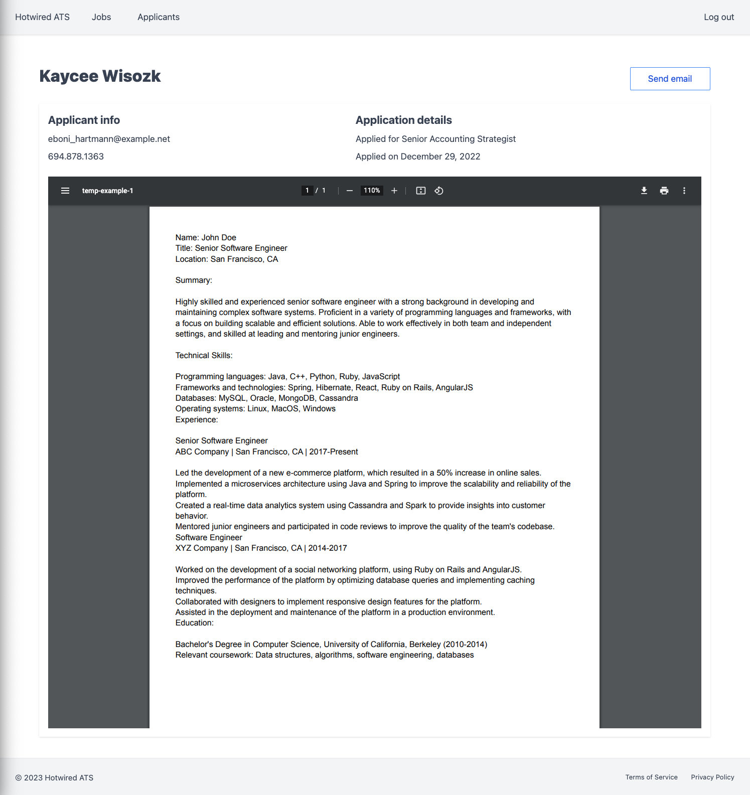
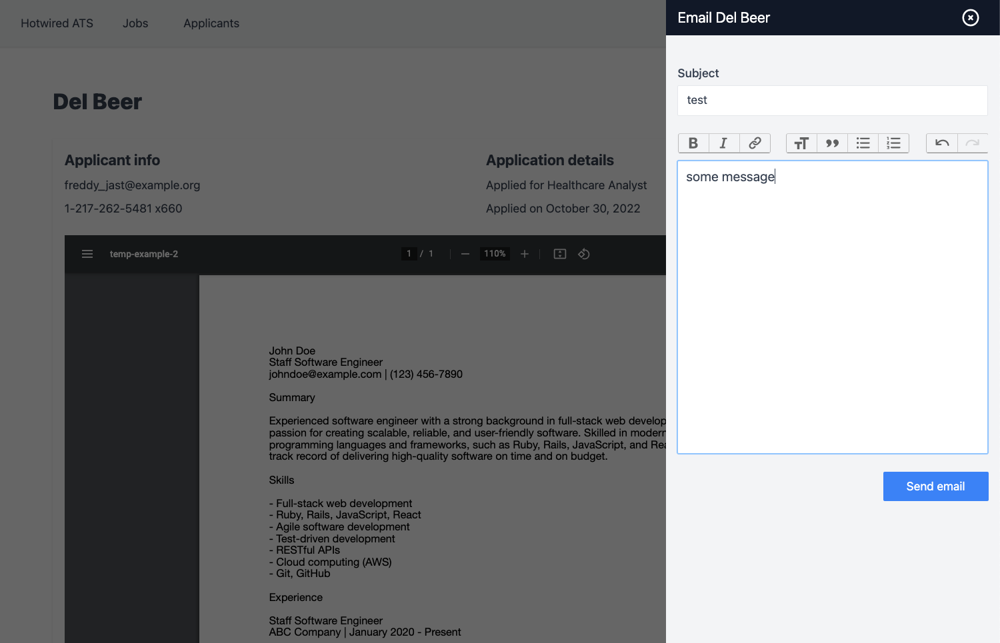
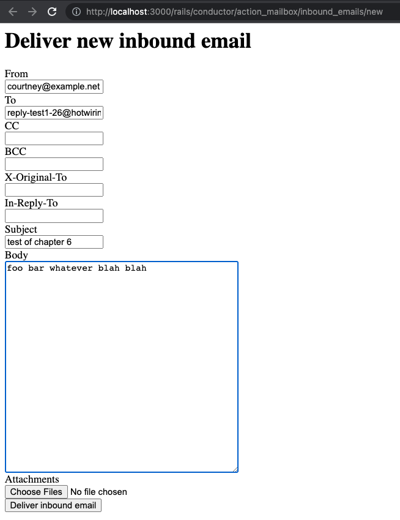
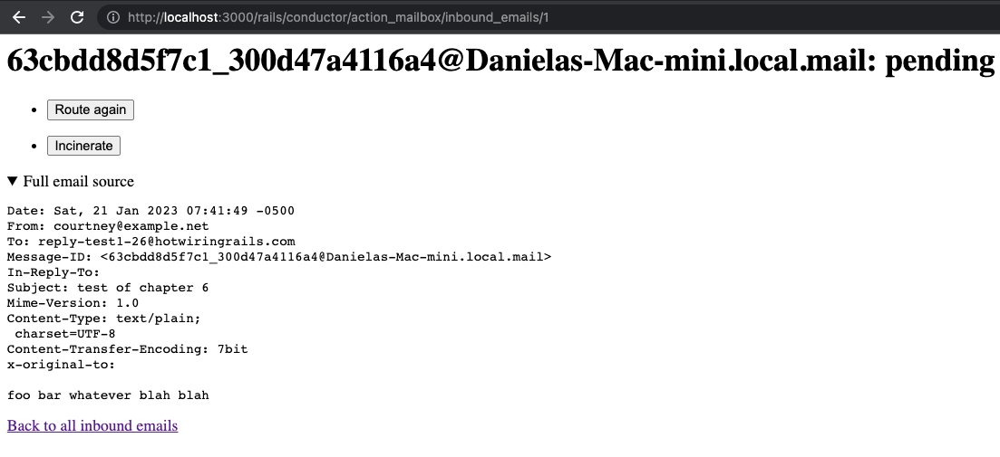
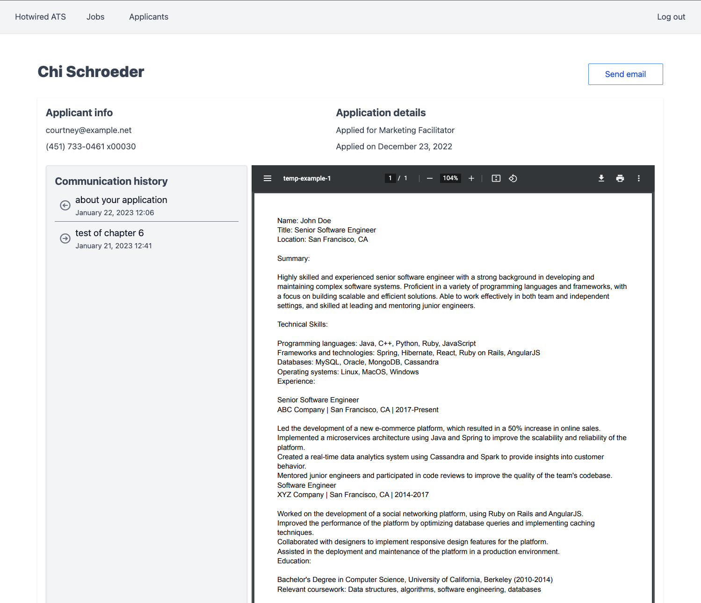

<!-- START doctoc generated TOC please keep comment here to allow auto update -->
<!-- DON'T EDIT THIS SECTION, INSTEAD RE-RUN doctoc TO UPDATE -->
**Table of Contents**  *generated with [DocToc](https://github.com/thlorenz/doctoc)*

- [Chapter 6: Viewing and contacting applicants](#chapter-6-viewing-and-contacting-applicants)
  - [Building the applicant show page](#building-the-applicant-show-page)
  - [Displaying resumes](#displaying-resumes)
  - [Build email resource](#build-email-resource)
  - [Send emails to applicants](#send-emails-to-applicants)
  - [Receive and process inbound email](#receive-and-process-inbound-email)
  - [Display previous emails on applicant record](#display-previous-emails-on-applicant-record)
  - [Reply to inbound emails](#reply-to-inbound-emails)

<!-- END doctoc generated TOC please keep comment here to allow auto update -->

# Chapter 6: Viewing and contacting applicants

Will be building applicant show page to display applicant details, including resume.

Will add ability to email applicants and receive replies using ActionMailbox.

## Building the applicant show page

According to author of book, after the applicant listing was wrapped in Turbo Frame, clicking on links to view applicants stopped working because navigation within Turbo Frame is scoped within that frame.

But for me, clicking Applicant name within the card partial `app/views/applicants/_card.html.erb` does work, doing a navigation to new page, for example: http://localhost:3000/applicants/243

In Chapter 5, used `data-turbo-frame` attribute to specify which turbo frame form response should get loaded into:

```erb
<!-- app/views/applicants/_filter_form.html.erb -->
<%= form_with url: applicants_path,
              method: :get,
              data: {
                controller: "form",
                form_target: "form",
                turbo_frame: "applicants",
                turbo_action: "advance"
              } do |form| %>
```

Can also use `data-turbo-frame` attribute to navigate from within a frame into a full page navigation by specifying `_top` value:

```erb
<!-- app/views/applicants/_card.html.erb -->
<h4 class="text-gray-900">
  <%= link_to(
    applicant.name,
    applicant,
    data: {
      turbo_frame: "_top"
    }
  ) %>
</h4>
```

Update applicant show view:

```erb
<div class="flex items-baseline justify-between mb-6 text-gray-700">
  <h2 class="mt-6 text-3xl font-extrabold">
    <%= @applicant.name %>
  </h2>
  <%= link_to "Send email", "#", class: "btn-primary-outline", data: { action: "click->slideover#open", remote: true } %>
</div>
<div class="shadow p-4 text-gray-700">
  <div class="flex justify-between mb-6">
    <div class="space-y-2">
      <h3 class="text-xl font-bold">Applicant info</h3>
      <p><%= mail_to @applicant.email %></p>
      <p><%= phone_to @applicant.phone %></p>
    </div>
    <div class="space-y-2">
      <h3 class="text-xl font-bold">Application details</h3>
      <p>Applied for <%= @applicant.job.title %></p>
      <p>Applied on <%= l(@applicant.created_at.to_date, format: :long) %></p>
    </div>
    <div class="space-y-2">
		<!-- Applicant actions go here -->
    </div>
  </div>
  <!-- Resume goes here -->
</div>
```

**Notes**

* opening "Send Email" slideover just opens the drawer empty for now, will fill it in later

## Displaying resumes

Resume is saved as pdf file and ActiveStorage. Could be large in case there's embedded images. Don't want user to wait for pdf to download before the Applicant show page renders.

Will use Turbo Frames to lazy load the pdf content. i.e. defer request for resume until the rest of the Applicant show page is loaded and frame is visible.

Start with Resumes controller:

```
rails g controller Resumes show
```

Update router to add a GET request for resumes, as part of applicants:

```ruby
# config/routes.rb
resources :applicants do
  patch :change_stage, on: :member
  get :resume, action: :show, controller: 'resumes'
end
```

Applicant routes now look like this - note that there is no resume `id`, because each applicant just has a single resume pdf file:

```
Prefix Verb   URI Pattern                                                                                       Controller#Action
change_stage_applicant PATCH  /applicants/:id/change_stage(.:format)                                                            applicants#change_stage
      applicant_resume GET    /applicants/:applicant_id/resume(.:format)                                                        resumes#show
            applicants GET    /applicants(.:format)                                                                             applicants#index
                       POST   /applicants(.:format)                                                                             applicants#create
         new_applicant GET    /applicants/new(.:format)                                                                         applicants#new
        edit_applicant GET    /applicants/:id/edit(.:format)                                                                    applicants#edit
             applicant GET    /applicants/:id(.:format)                                                                         applicants#show
                       PATCH  /applicants/:id(.:format)                                                                         applicants#update
                       PUT    /applicants/:id(.:format)                                                                         applicants#update
                       DELETE /applicants/:id(.:format)                                                                         applicants#destroy
```

Add `show` action in resumes controller - note again no resume id, just applicant id, find the applicant, then return their associated ActiveStorage resume:

```ruby
# app/controllers/resumes_controller.rb
class ResumesController < ApplicationController
  before_action :authenticate_user!
  before_action :set_applicant, only: %i[show]

  def show
    @resume = @applicant.resume
  end

  private

  def set_applicant
    @applicant = Applicant.find(params[:applicant_id])
  end
end
```

Resume show view:

```erb
<!-- app/views/resumes/show.html.erb -->
<%= turbo_frame_tag "resume" do %>
  <div class="w-full">
    <iframe src="<%= url_for(@resume) %>" width="100%" height="1000"></iframe>
  </div>
<% end %>
```

**Notes**

* resume show view is wrapped in `turbo_frame_tag`
* applicant show page will have a matching empty Turbo Frame that the resume show view will be responsible for replacing
* using [url_for](https://edgeguides.rubyonrails.org/active_storage_overview.html#redirect-mode) from ActiveStorage to build `src` for iframe
* value of `url_for(@resume)` returns something like: `/rails/active_storage/blobs/redirect/eyJfcmFpbHMiOnsibWVzc2FnZSI6IkJBaHBBZ3NCIiwiZXhwIjpudWxsLCJwdXIiOiJibG9iX2lkIn19--defc26cac0e26bb770674c52819c957da166be14/temp-example-1.pdf`

Update applicants show page to render empty TurboFrame for `resume`:

```erb
<% if @applicant.resume.attached? %>
  <%= turbo_frame_tag "resume", src: applicant_resume_path(@applicant), loading: "lazy" do %>
    <div class="w-full bg-gray-100 rounded flex justify-center items-center h-[1000px]">
      Loading...
    </div>
  <% end %>
<% end %>
```

**Notes**

* `src` attribute on turbo_frame_tag tells Turbo to load content from a [specified url](https://turbo.hotwired.dev/reference/frames#eager-loaded-frame)
* `applicant_resume_path(@applicant)` returns something like: `http://localhost:3000/applicants/269/resume`
* `loading: "lazy"` [attribute](https://turbo.hotwired.dev/reference/frames#lazy-loaded-frame) tells Turbo to wait until frame is visible before loading the content

Try refresh applicant show page for applicant with a resume -> page initially shows "Loading..." placeholder content inside resume turbo frame. Then request sent to `/applicants:id/resume` and content of resume frame replaced with applicant's pdf resume file, embedded in PDF viewer.

Rails server output first has request to: `Started GET "/applicants/269"`, and after that view renders, Rails server receives second request to `Started GET "/applicants/269/resume"`.

After resume loaded, applicant show page for a particular applicant such as http://localhost:3000/applicants/269 looks like this:



**Notes**

* With eager or lazy loaded Turbo Frame, additional attributes that you want to set on frame such as `src` or `lazy` *must* be set when frame is initially rendered. In our example, `src` and `lazy` set on version of frame rendered by `applicant#show` view.
* When frame enters DOM, Turbo processes the attributes to trigger a request to the url specified by `src`, then replaces the inner HTML of the Turbo Frame with response from server (`resumes#show` in our example).
* Turbo Frame requests only update inner HTML of Turbo Frame
* Parent `turbo-frame` element is almost never modified after first time render

## Build email resource

Will build email system for outbound emails to applicants, replies from applicants, and replying to replies via email threads.

Store all emails (inbound/outbound) in `emails` table:

```
bin/rails g model Email applicant:references user:references subject:text sent_at:datetime
bin/rails db:migrate
```

Add `body` field as rich text and validation of `subject` field:

```ruby
# app/models/email.rb
class Email < ApplicationRecord
  has_rich_text :body

  belongs_to :applicant
  belongs_to :user

  validates_presence_of :subject
end
```

Update User and Applicant models to specify has_many emails:

```ruby
# This line goes in both the User model and the Applicant model
has_many :emails, dependent: :destroy
```

Generate emails controller:

```
rails g controller Emails
touch app/views/emails/_form.html.erb
```

Update router - notice the emails routes are nested under applicants

```ruby
resources :applicants do
  patch :change_stage, on: :member
  resources :emails, only: %i[index new create show]
  get :resume, action: :show, controller: 'resumes'
end
```

Applicant routes now are:

```
Prefix Verb   URI Pattern                                                                                       Controller#Action
change_stage_applicant PATCH  /applicants/:id/change_stage(.:format)                                                            applicants#change_stage
      applicant_emails GET    /applicants/:applicant_id/emails(.:format)                                                        emails#index
                       POST   /applicants/:applicant_id/emails(.:format)                                                        emails#create
   new_applicant_email GET    /applicants/:applicant_id/emails/new(.:format)                                                    emails#new
       applicant_email GET    /applicants/:applicant_id/emails/:id(.:format)                                                    emails#show
      applicant_resume GET    /applicants/:applicant_id/resume(.:format)                                                        resumes#show
            applicants GET    /applicants(.:format)                                                                             applicants#index
                       POST   /applicants(.:format)                                                                             applicants#create
         new_applicant GET    /applicants/new(.:format)                                                                         applicants#new
        edit_applicant GET    /applicants/:id/edit(.:format)                                                                    applicants#edit
             applicant GET    /applicants/:id(.:format)                                                                         applicants#show
                       PATCH  /applicants/:id(.:format)                                                                         applicants#update
                       PUT    /applicants/:id(.:format)                                                                         applicants#update
                       DELETE /applicants/:id(.:format)                                                                         applicants#destroy
```

Here is the email form partial:

```erb
<!-- app/views/emails/_form.html.erb -->
<%= form_with(model: [applicant, email], id: 'email-form', html: { class: "space-y-6" }, data: { remote: true }) do |form| %>
  <% if email.errors.any? %>
    <div id="error_explanation">
      <h2><%= pluralize(email.errors.count, "error") %> prohibited this email from being saved:</h2>

      <ul>
        <% email.errors.each do |error| %>
          <li><%= error.full_message %></li>
        <% end %>
      </ul>
    </div>
  <% end %>

  <div class="form-group">
    <%= form.label :subject %>
    <div class="mt-1">
      <%= form.text_field :subject %>
    </div>
  </div>

  <div class="form-group">
    <%= form.rich_text_area :body %>
  </div>

  <%= form.submit 'Send email', class: 'btn-primary float-right' %>
<% end %>
```

**Notes**

* Mrujs + CableCar will be handling form submission that's why data `remote: true` is set on form element.
* Using Trix editor via `form.rich_text_area` to allow some formatting of email `body`.

Update emails controller `new`, `create` actions - similar CableCar logic used for Jobs, Applicants:

```ruby
# app/controllers/emails_controller.rb
class EmailsController < ApplicationController
  before_action :authenticate_user!
  before_action :set_applicant

  def new
    @email = Email.new
    html = render_to_string(partial: 'form', locals: { email: @email, applicant: @applicant })
    render operations: cable_car
      .inner_html('#slideover-content', html: html)
      .text_content('#slideover-header', text: "Email #{@applicant.name}")
  end

  def create
    @email = Email.new(email_params)

    @email.applicant = @applicant
    @email.user = current_user
    if @email.save
      html = render_to_string(partial: 'shared/flash', locals: { level: :success, content: 'Email sent!' })
      render operations: cable_car
        .inner_html('#flash-container', html: html)
        .dispatch_event(name: 'submit:success')
    else
      html = render_to_string(partial: 'form', locals: { applicant: @applicant, email: @email })
      render operations: cable_car
        .inner_html('#email-form', html: html), status: :unprocessable_entity
    end
  end

  private

  def set_applicant
    @applicant = Applicant.find(params[:applicant_id])
  end

  def email_params
    params.require(:email).permit(:subject, :body)
  end
end
```

**Notes**

* Difference from applicants and jobs controller is `create` action renders flash message confirming email sent. Use this technique when results of user's actions are not obvious to them.
* Email hasn't really been sent yet, only saved to `emails` table, will deal with this in next section.

Make the email form render in slideover by updating Send Email link on applicant show page:

```erb
<%= link_to "Send email",
new_applicant_email_path(@applicant),
class: "btn-primary-outline",
data: {
  action: "click->slideover#open",
  remote: true
} %>
```

## Send emails to applicants

Create a new [mailer](https://guides.rubyonrails.org/action_mailer_basics.html#create-the-mailer):

```
bin/rails g mailer Applicant contact
  create  app/mailers/applicant_mailer.rb
  invoke  erb
  create    app/views/applicant_mailer
  create    app/views/applicant_mailer/contact.text.erb
  create    app/views/applicant_mailer/contact.html.erb
```

**Notes**

* Mailer used to send outbound emails to applicants
* Email content will be from `rich_text :body` field from Email model

Update the generated applicant_mailer:

```ruby
# app/mailers/applicant_mailer.rb
class ApplicantMailer < ApplicationMailer
  def contact(email:)
    @email = email
    @applicant = @email.applicant
    @user = @email.user

    mail(
      to: @applicant.email,
      from: @user.email,
      subject: @email.subject
    )
  end
end
```

**Notes**

* `contact` method used to generate and send email
* `contact` method accepts an `email` argument, which will be `Email` model instance from database
* `mail` method constructs outgoing email

Fill in HTML and text content of `contact` mailer:

```erb
<!-- /Users/dbaron/projects/rails7/hotwired_ats/app/views/applicant_mailer/contact.html.erb -->
<%= @email.body %>
```

```erb
<!-- app/views/applicant_mailer/contact.text.erb -->
<%= @email.body.to_plain_text %>
```

To send email from app, use ActiveRecord [after_create_commit](https://api.rubyonrails.org/v7.0.4/classes/ActiveRecord/Transactions/ClassMethods.html#method-i-after_create_commit) callback in `Email` model. Also see [Transaction Callbacks](https://guides.rubyonrails.org/active_record_callbacks.html#transaction-callbacks) in Rails Guides.

```ruby
# app/models/email.rb
after_create_commit :send_email

def send_email
  ApplicantMailer.contact(email: self).deliver_later
end
```

**Notes**

* `after_create_commit` callback runs after new email record is added to the database
* `deliver_later` sends email as background task.
* We have not configured a persistent back end for ActiveJob so the default is an in-process thread pool, jobs in queue are dropped upon app restart. Fine for learning app but for production app, would need a real back end like Delayed Job, Resque, Sidekiq etc. See [Active Job Basics](https://guides.rubyonrails.org/active_job_basics.html).

Try this out by navigating to any applicant show view, eg: `http://localhost:3000/applicants/278`, click Send email, fill out the form and submit.



Rails server output shows a new record being saved in `emails` table with `body` being stored as rich text in `action_text_rich_texts` table.

Then ActiveJob is used to enqueue a `ActionMailer::MailDeliveryJob`. Then the job runs, rendering the email template and displaying result in console.

Don't know why it queries `active_storage_attachments` for record_id 233, this doesn't exist in database???
233 is id of `action_text_rich_texts` record containing email body. Maybe it's checking if there's also an attachment to send via email?

```
Started POST "/applicants/278/emails" for ::1 at 2023-01-14 07:45:51 -0500
Processing by EmailsController#create as CABLE_READY
  Parameters: {"authenticity_token"=>"[FILTERED]", "email"=>{"subject"=>"test", "body"=>"<div>some message</div>"}, "commit"=>"Send email", "applicant_id"=>"278"}
  User Load (5.0ms)  SELECT "users".* FROM "users" WHERE "users"."id" = $1 ORDER BY "users"."id" ASC LIMIT $2  [["id", 26], ["LIMIT", 1]]
  Applicant Load (1.8ms)  SELECT "applicants".* FROM "applicants" WHERE "applicants"."id" = $1 LIMIT $2  [["id", 278], ["LIMIT", 1]]
  ↳ app/controllers/emails_controller.rb:33:in `set_applicant'
  TRANSACTION (1.9ms)  BEGIN
  ↳ app/controllers/emails_controller.rb:18:in `create'
  Email Create (14.2ms)  INSERT INTO "emails" ("applicant_id", "user_id", "subject", "sent_at", "created_at", "updated_at") VALUES ($1, $2, $3, $4, $5, $6) RETURNING "id"  [["applicant_id", 278], ["user_id", 26], ["subject", "test"], ["sent_at", nil], ["created_at", "2023-01-14 12:45:51.949052"], ["updated_at", "2023-01-14 12:45:51.949052"]]
  ↳ app/controllers/emails_controller.rb:18:in `create'
   ActionText::RichText Create (6.0ms)  INSERT INTO "action_text_rich_texts" ("name", "body", "record_type", "record_id", "created_at", "updated_at") VALUES ($1, $2, $3, $4, $5, $6) RETURNING "id"  [["name", "body"], ["body", "<div>some message</div>"], ["record_type", "Email"], ["record_id", 2], ["created_at", "2023-01-14 12:45:52.029109"], ["updated_at", "2023-01-14 12:45:52.029109"]]
   ↳ app/controllers/emails_controller.rb:18:in `create'
   ActiveStorage::Attachment Load (3.0ms)  SELECT "active_storage_attachments".* FROM "active_storage_attachments" WHERE "active_storage_attachments"."record_id" = $1 AND "active_storage_attachments"."record_type" = $2 AND "active_storage_attachments"."name" = $3  [["record_id", 233], ["record_type", "ActionText::RichText"], ["name", "embeds"]]
   ↳ app/controllers/emails_controller.rb:18:in `create'
   Email Update (16.3ms)  UPDATE "emails" SET "updated_at" = $1 WHERE "emails"."id" = $2  [["updated_at", "2023-01-14 12:45:52.040717"], ["id", 2]]
   ↳ app/controllers/emails_controller.rb:18:in `create'
   TRANSACTION (3.3ms)  COMMIT
   ↳ app/controllers/emails_controller.rb:18:in `create'
 [ActiveJob] Enqueued ActionMailer::MailDeliveryJob (Job ID: 0450db20-369e-4630-aed4-fe27d036bd62) to Async(default) with arguments: "ApplicantMailer", "contact", "deliver_now", {:args=>[{:email=>#<GlobalID:0x000000010c3ace58 @uri=#<URI::GID gid://hotwired-ats/Email/2>>}]}
   Rendered shared/_flash.html.erb (Duration: 15.7ms | Allocations: 1129)
 Completed 200 OK in 527ms (Views: 1.9ms | ActiveRecord: 88.5ms | Allocations: 30309)


 [ActiveJob] [ActionMailer::MailDeliveryJob] [0450db20-369e-4630-aed4-fe27d036bd62]   Email Load (2.7ms)  SELECT "emails".* FROM "emails" WHERE "emails"."id" = $1 LIMIT $2  [["id", 2], ["LIMIT", 1]]
 [ActiveJob] [ActionMailer::MailDeliveryJob] [0450db20-369e-4630-aed4-fe27d036bd62] Performing ActionMailer::MailDeliveryJob (Job ID: 0450db20-369e-4630-aed4-fe27d036bd62) from Async(default) enqueued at 2023-01-14T12:45:52Z with arguments: "ApplicantMailer", "contact", "deliver_now", {:args=>[{:email=>#<GlobalID:0x000000010c414940 @uri=#<URI::GID gid://hotwired-ats/Email/2>>}]}
 [ActiveJob] [ActionMailer::MailDeliveryJob] [0450db20-369e-4630-aed4-fe27d036bd62]   Applicant Load (4.2ms)  SELECT "applicants".* FROM "applicants" WHERE "applicants"."id" = $1 LIMIT $2  [["id", 278], ["LIMIT", 1]]
 [ActiveJob] [ActionMailer::MailDeliveryJob] [0450db20-369e-4630-aed4-fe27d036bd62]   ↳ app/mailers/applicant_mailer.rb:4:in `contact'
 [ActiveJob] [ActionMailer::MailDeliveryJob] [0450db20-369e-4630-aed4-fe27d036bd62]   User Load (3.3ms)  SELECT "users".* FROM "users" WHERE "users"."id" = $1 LIMIT $2  [["id", 26], ["LIMIT", 1]]
 [ActiveJob] [ActionMailer::MailDeliveryJob] [0450db20-369e-4630-aed4-fe27d036bd62]   ↳ app/mailers/applicant_mailer.rb:5:in `contact'
 [ActiveJob] [ActionMailer::MailDeliveryJob] [0450db20-369e-4630-aed4-fe27d036bd62]   Rendering layout layouts/mailer.html.erb
 [ActiveJob] [ActionMailer::MailDeliveryJob] [0450db20-369e-4630-aed4-fe27d036bd62]   Rendering applicant_mailer/contact.html.erb within layouts/mailer
 [ActiveJob] [ActionMailer::MailDeliveryJob] [0450db20-369e-4630-aed4-fe27d036bd62]   ActionText::RichText Load (5.1ms)  SELECT "action_text_rich_texts".* FROM "action_text_rich_texts" WHERE "action_text_rich_texts"."record_id" = $1 AND "action_text_rich_texts"."record_type" = $2 AND "action_text_rich_texts"."name" = $3 LIMIT $4  [["record_id", 2], ["record_type", "Email"], ["name", "body"], ["LIMIT", 1]]
 [ActiveJob] [ActionMailer::MailDeliveryJob] [0450db20-369e-4630-aed4-fe27d036bd62]   ↳ app/views/applicant_mailer/contact.html.erb:1
 [ActiveJob] [ActionMailer::MailDeliveryJob] [0450db20-369e-4630-aed4-fe27d036bd62]   Rendered /Users/dbaron/.rbenv/versions/3.1.2/lib/ruby/gems/3.1.0/gems/actiontext-7.0.4/app/views/action_text/contents/_content.html.erb within layouts/action_text/contents/_content (Duration: 29.7ms | Allocations: 565)
 [ActiveJob] [ActionMailer::MailDeliveryJob] [0450db20-369e-4630-aed4-fe27d036bd62]   Rendered applicant_mailer/contact.html.erb within layouts/mailer (Duration: 46.0ms | Allocations: 2445)
 [ActiveJob] [ActionMailer::MailDeliveryJob] [0450db20-369e-4630-aed4-fe27d036bd62]   Rendered layout layouts/mailer.html.erb (Duration: 84.6ms | Allocations: 2685)
 [ActiveJob] [ActionMailer::MailDeliveryJob] [0450db20-369e-4630-aed4-fe27d036bd62]   Rendering layout layouts/mailer.text.erb
 [ActiveJob] [ActionMailer::MailDeliveryJob] [0450db20-369e-4630-aed4-fe27d036bd62]   Rendering applicant_mailer/contact.text.erb within layouts/mailer
 [ActiveJob] [ActionMailer::MailDeliveryJob] [0450db20-369e-4630-aed4-fe27d036bd62]   Rendered applicant_mailer/contact.text.erb within layouts/mailer (Duration: 9.3ms | Allocations: 617)
 [ActiveJob] [ActionMailer::MailDeliveryJob] [0450db20-369e-4630-aed4-fe27d036bd62]   Rendered layout layouts/mailer.text.erb (Duration: 11.5ms | Allocations: 849)
 [ActiveJob] [ActionMailer::MailDeliveryJob] [0450db20-369e-4630-aed4-fe27d036bd62] ApplicantMailer#contact: processed outbound mail in 242.4ms
 [ActiveJob] [ActionMailer::MailDeliveryJob] [0450db20-369e-4630-aed4-fe27d036bd62] Delivered mail 63c2a400aae26_1d3ddc28778bf@Danielas-Mac-mini.local.mail (81.8ms)
 [ActiveJob] [ActionMailer::MailDeliveryJob] [0450db20-369e-4630-aed4-fe27d036bd62] Date: Sat, 14 Jan 2023 07:45:52 -0500
 From: test1@example.com
 To: freddy_jast@example.org
 Message-ID: <63c2a400aae26_1d3ddc28778bf@Danielas-Mac-mini.local.mail>
 Subject: test
 Mime-Version: 1.0
 Content-Type: multipart/alternative;
  boundary="--==_mimepart_63c2a4008c21a_1d3ddc28777ae";
  charset=UTF-8
 Content-Transfer-Encoding: 7bit


 ----==_mimepart_63c2a4008c21a_1d3ddc28777ae
 Content-Type: text/plain;
  charset=UTF-8
 Content-Transfer-Encoding: 7bit

 some message

 ----==_mimepart_63c2a4008c21a_1d3ddc28777ae
 Content-Type: text/html;
  charset=UTF-8
 Content-Transfer-Encoding: 7bit

 <!DOCTYPE html>
 <html>
   <head>
     <meta http-equiv="Content-Type" content="text/html; charset=utf-8" />
     <style>
       /* Email styles need to be inline */
     </style>
   </head>

   <body>
     <div class="trix-content">
   <div>some message</div>
 </div>

   </body>
 </html>

 ----==_mimepart_63c2a4008c21a_1d3ddc28777ae--

 [ActiveJob] [ActionMailer::MailDeliveryJob] [0450db20-369e-4630-aed4-fe27d036bd62] Performed ActionMailer::MailDeliveryJob (Job ID: 0450db20-369e-4630-aed4-fe27d036bd62) from Async(default) in 463.86ms
```

Optional gem to setup GUI for viewing sent emails in dev: https://github.com/fgrehm/letter_opener_web

## Receive and process inbound email

At this point, a user of ATS can send email to an applicant, but can't view emails they've sent or receive replies.

Will use [ActionMailbox](https://guides.rubyonrails.org/action_mailbox_basics.html) for these.

> Action Mailbox routes incoming emails to controller-like mailboxes for processing in Rails. It ships with ingresses for Mailgun, Mandrill, Postmark, and SendGrid. You can also handle inbound mails directly via the built-in Exim, Postfix, and Qmail ingresses.

> The inbound emails are turned into InboundEmail records using Active Record and feature lifecycle tracking, storage of the original email on cloud storage via Active Storage, and responsible data handling with on-by-default incineration.

> These inbound emails are routed asynchronously using Active Job to one or several dedicated mailboxes, which are capable of interacting directly with the rest of your domain model.

For ATS, will keep it simple with single mailbox for rouring inbound email replies from applicants.

Install:

```
rails action_mailbox:install
```

Output:

```
Copying application_mailbox.rb to app/mailboxes
      create  app/mailboxes/application_mailbox.rb
       rails  railties:install:migrations FROM=active_storage,action_mailbox
Copied migration 20230114132135_create_action_mailbox_tables.action_mailbox.rb from action_mailbox
```

Migrate database and create new mailbox ApplicantReplies:

```
rails db:migrate
rails g mailbox ApplicantReplies
```

Output:

```
== 20230114132135 CreateActionMailboxTables: migrating ========================
-- create_table(:action_mailbox_inbound_emails)
   -> 0.0440s
== 20230114132135 CreateActionMailboxTables: migrated (0.0441s) ===============

create  app/mailboxes/applicant_replies_mailbox.rb
```

Now we have an `ApplicationMailbox` to setup routing rules for inbound emails. Update it to add new rule for `ApplicantReplies` mailbox, telling it that any inbound emails with `reply` in the `to` address should be sent to the `ApplicantReplies` mailbox for processing and delivering to the right user:

```ruby
# app/mailboxes/application_mailbox.rb
class ApplicationMailbox < ActionMailbox::Base
  routing /reply/i => :applicant_replies
end
```

And here is the applicant replies mailbox:

```ruby
# app/mailboxes/applicant_replies_mailbox.rb
class ApplicantRepliesMailbox < ApplicationMailbox
  ALIASED_USER = /reply-(.+)@hotwiringrails.com/i

  before_processing :set_applicant
  before_processing :set_user

  def process
    email = build_email
    email.body = mail.parts.present? ? mail.parts[0].body.decoded : mail.decoded
    email.save
  end

  private

  def build_email
    Email.new(
      user_id: @user.id,
      applicant_id: @applicant.id,
      subject: mail.subject
    )
  end

  def set_applicant
    @applicant = Applicant.find_by(email: mail.from)
  end

  def set_user
    recipient = mail.recipients.find{ |r| ALIASED_USER.match?(r) }
    @user = User.find_by(email_alias: recipient[ALIASED_USER, 1])
  end
end
```

Add `email_alias` column to Users table in support of above routing logic

```
bin/rails g migration AddEmailAliasToUser email_alias:string:index
bin/rails db:migrate
```

Populate new email_alias column in User model callback:

```ruby
# app/models/user.rb
after_create_commit :generate_alias

def generate_alias
  email_alias = "#{email.split('@')[0]}-#{id}"
  update_column(:email_alias, email_alias)
end
```

Update existing users to populate alias column in Rails console:

```ruby
User.all.each{ |user| user.generate_alias && user.save }
```

Update ApplicantMailer so that replies are sent to email address that matches alias. Notice the `from` address is now using the alias:

```ruby
# app/mailers/applicant_mailer.rb
class ApplicantMailer < ApplicationMailer
  def contact(email:)
    @email = email
    @applicant = @email.applicant
    @user = @email.user

    mail(
      to: @applicant.email,
      from: "reply-#{@user.email_alias}@hotwiringrails.com",
      subject: @email.subject
    )
  end
end
```

Update Email table/model with `email_type` to distinguish inbound vs outbound:

```
bin/rails g migration AddEmailTypeToEmails email_type:string
bin/rails db:migrate
```

```ruby
after_create_commit :send_email, if: :outbound?

enum email_type: {
  outbound: 'outbound',
  inbound: 'inbound'
}
```

Update ApplicantReplies mailbox to set email type for inbound procesing:

```ruby
# app/mailboxes/applicant_replies_mailbox.rb
def build_email
  Email.new(
    user_id: @user.id,
    applicant_id: @applicant.id,
    subject: mail.subject,
    email_type: 'inbound'
  )
end
```

Update EmailsController to set outbound type:

```ruby
# app/controllers/emails_controller.rb
def create
  @email = Email.new(email_params)
  @email.email_type = 'outbound'
  # Snip
end
```

To try it out locally, use Rails Conductor at: http://localhost:3000/rails/conductor/action_mailbox/inbound_emails/new:

* from address should matche the email address of an applicant in the database
* to address should include an alias for a user in the database and matches the routing and regex rules we defined when we set up the mailbox.



After submitting form, Rails server output:

```
Started POST "/rails/conductor/action_mailbox/inbound_emails" for ::1 at 2023-01-21 07:41:49 -0500
Processing by Rails::Conductor::ActionMailbox::InboundEmailsController#create as HTML
  Parameters: {"authenticity_token"=>"[FILTERED]", "mail"=>{"from"=>"courtney@example.net", "to"=>"reply-test1-26@hotwiringrails.com", "cc"=>"", "bcc"=>"", "x_original_to"=>"", "in_reply_to"=>"", "subject"=>"test of chapter 6", "body"=>"foo bar whatever blah blah", "attachments"=>[""]}, "commit"=>"Deliver inbound email"}
  TRANSACTION (1.7ms)  BEGIN
  ActiveStorage::Blob Create (18.0ms)  INSERT INTO "active_storage_blobs" ("key", "filename", "content_type", "metadata", "service_name", "byte_size", "checksum", "created_at") VALUES ($1, $2, $3, $4, $5, $6, $7, $8) RETURNING "id"  [["key", "o585a0y4t378m0qyjetiihn7k9uo"], ["filename", "message.eml"], ["content_type", "message/rfc822"], ["metadata", "{\"identified\":true}"], ["service_name", "local"], ["byte_size", 361], ["checksum", "ZLddRIJwZEvqhhDfX2Nsqw=="], ["created_at", "2023-01-21 12:41:49.658233"]]
  TRANSACTION (19.7ms)  COMMIT
  Disk Storage (1.2ms) Uploaded file to key: o585a0y4t378m0qyjetiihn7k9uo (checksum: ZLddRIJwZEvqhhDfX2Nsqw==)
  TRANSACTION (11.4ms)  BEGIN
  ActionMailbox::InboundEmail Create (7.5ms)  INSERT INTO "action_mailbox_inbound_emails" ("status", "message_id", "message_checksum", "created_at", "updated_at") VALUES ($1, $2, $3, $4, $5) RETURNING "id"  [["status", 0], ["message_id", "63cbdd8d5f7c1_300d47a4116a4@Danielas-Mac-mini.local.mail"], ["message_checksum", "b62e6f31e895a3f776ea00d9fc8d400e87cdfc0e"], ["created_at", "2023-01-21 12:41:49.752201"], ["updated_at", "2023-01-21 12:41:49.752201"]]
  ActiveStorage::Blob Load (14.0ms)  SELECT "active_storage_blobs".* FROM "active_storage_blobs" INNER JOIN "active_storage_attachments" ON "active_storage_blobs"."id" = "active_storage_attachments"."blob_id" WHERE "active_storage_attachments"."record_id" = $1 AND "active_storage_attachments"."record_type" = $2 AND "active_storage_attachments"."name" = $3 LIMIT $4  [["record_id", 1], ["record_type", "ActionMailbox::InboundEmail"], ["name", "raw_email"], ["LIMIT", 1]]
  ActiveStorage::Attachment Load (2.0ms)  SELECT "active_storage_attachments".* FROM "active_storage_attachments" WHERE "active_storage_attachments"."record_id" = $1 AND "active_storage_attachments"."record_type" = $2 AND "active_storage_attachments"."name" = $3 LIMIT $4  [["record_id", 1], ["record_type", "ActionMailbox::InboundEmail"], ["name", "raw_email"], ["LIMIT", 1]]
  ActiveStorage::Attachment Create (7.7ms)  INSERT INTO "active_storage_attachments" ("name", "record_type", "record_id", "blob_id", "created_at") VALUES ($1, $2, $3, $4, $5) RETURNING "id"  [["name", "raw_email"], ["record_type", "ActionMailbox::InboundEmail"], ["record_id", 1], ["blob_id", 291], ["created_at", "2023-01-21 12:41:50.159267"]]
  ActionMailbox::InboundEmail Update (14.0ms)  UPDATE "action_mailbox_inbound_emails" SET "updated_at" = $1 WHERE "action_mailbox_inbound_emails"."id" = $2  [["updated_at", "2023-01-21 12:41:50.186861"], ["id", 1]]
  TRANSACTION (4.5ms)  COMMIT
[ActiveJob] Enqueued ActionMailbox::RoutingJob (Job ID: fc6ab289-a2f9-4ae5-8d15-c8d8a2dfab4e) to Async(default) with arguments: #<GlobalID:0x0000000107018f30 @uri=#<URI::GID gid://hotwired-ats/ActionMailbox::InboundEmail/1>>
  TRANSACTION (29.1ms)  BEGIN
  ActiveStorage::Blob Update (2.7ms)  UPDATE "active_storage_blobs" SET "metadata" = $1 WHERE "active_storage_blobs"."id" = $2  [["metadata", "{\"identified\":true,\"analyzed\":true}"], ["id", 291]]
  TRANSACTION (11.0ms)  COMMIT
Redirected to http://localhost:3000/rails/conductor/action_mailbox/inbound_emails/1
Completed 302 Found in 1119ms (ActiveRecord: 234.2ms | Allocations: 60045)


Started GET "/rails/conductor/action_mailbox/inbound_emails/1" for ::1 at 2023-01-21 07:41:50 -0500
Processing by Rails::Conductor::ActionMailbox::InboundEmailsController#show as HTML
  Parameters: {"id"=>"1"}
  ActionMailbox::InboundEmail Load (2.1ms)  SELECT "action_mailbox_inbound_emails".* FROM "action_mailbox_inbound_emails" WHERE "action_mailbox_inbound_emails"."id" = $1 LIMIT $2  [["id", 1], ["LIMIT", 1]]
[ActiveJob] [ActionMailbox::RoutingJob] [fc6ab289-a2f9-4ae5-8d15-c8d8a2dfab4e]   ActionMailbox::InboundEmail Load (5.5ms)  SELECT "action_mailbox_inbound_emails".* FROM "action_mailbox_inbound_emails" WHERE "action_mailbox_inbound_emails"."id" = $1 LIMIT $2  [["id", 1], ["LIMIT", 1]]
  Rendering layout /Users/dbaron/.rbenv/versions/3.1.2/lib/ruby/gems/3.1.0/gems/actionmailbox-7.0.4/app/views/layouts/rails/conductor.html.erb
  Rendering /Users/dbaron/.rbenv/versions/3.1.2/lib/ruby/gems/3.1.0/gems/actionmailbox-7.0.4/app/views/rails/conductor/action_mailbox/inbound_emails/show.html.erb within layouts/rails/conductor
[ActiveJob] [ActionMailbox::RoutingJob] [fc6ab289-a2f9-4ae5-8d15-c8d8a2dfab4e] Performing ActionMailbox::RoutingJob (Job ID: fc6ab289-a2f9-4ae5-8d15-c8d8a2dfab4e) from Async(default) enqueued at 2023-01-21T12:41:50Z with arguments: #<GlobalID:0x0000000107141c18 @uri=#<URI::GID gid://hotwired-ats/ActionMailbox::InboundEmail/1>>
  ActiveStorage::Attachment Load (103.8ms)  SELECT "active_storage_attachments".* FROM "active_storage_attachments" WHERE "active_storage_attachments"."record_id" = $1 AND "active_storage_attachments"."record_type" = $2 AND "active_storage_attachments"."name" = $3 LIMIT $4  [["record_id", 1], ["record_type", "ActionMailbox::InboundEmail"], ["name", "raw_email"], ["LIMIT", 1]]
  ActiveStorage::Blob Load (3.2ms)  SELECT "active_storage_blobs".* FROM "active_storage_blobs" WHERE "active_storage_blobs"."id" = $1 LIMIT $2  [["id", 291], ["LIMIT", 1]]
  Disk Storage (0.2ms) Downloaded file from key: o585a0y4t378m0qyjetiihn7k9uo
  Rendered /Users/dbaron/.rbenv/versions/3.1.2/lib/ruby/gems/3.1.0/gems/actionmailbox-7.0.4/app/views/rails/conductor/action_mailbox/inbound_emails/show.html.erb within layouts/rails/conductor (Duration: 770.2ms | Allocations: 230218)
  Rendered layout /Users/dbaron/.rbenv/versions/3.1.2/lib/ruby/gems/3.1.0/gems/actionmailbox-7.0.4/app/views/layouts/rails/conductor.html.erb (Duration: 770.6ms | Allocations: 230300)
Completed 200 OK in 820ms (Views: 683.6ms | ActiveRecord: 109.1ms | Allocations: 233373)


[ActiveJob] [ActionMailbox::RoutingJob] [fc6ab289-a2f9-4ae5-8d15-c8d8a2dfab4e]   ActiveStorage::Attachment Load (57.8ms)  SELECT "active_storage_attachments".* FROM "active_storage_attachments" WHERE "active_storage_attachments"."record_id" = $1 AND "active_storage_attachments"."record_type" = $2 AND "active_storage_attachments"."name" = $3 LIMIT $4  [["record_id", 1], ["record_type", "ActionMailbox::InboundEmail"], ["name", "raw_email"], ["LIMIT", 1]]
[ActiveJob] [ActionMailbox::RoutingJob] [fc6ab289-a2f9-4ae5-8d15-c8d8a2dfab4e]   ActiveStorage::Blob Load (6.0ms)  SELECT "active_storage_blobs".* FROM "active_storage_blobs" WHERE "active_storage_blobs"."id" = $1 LIMIT $2  [["id", 291], ["LIMIT", 1]]
[ActiveJob] [ActionMailbox::RoutingJob] [fc6ab289-a2f9-4ae5-8d15-c8d8a2dfab4e]   Disk Storage (0.1ms) Downloaded file from key: o585a0y4t378m0qyjetiihn7k9uo
[ActiveJob] [ActionMailbox::RoutingJob] [fc6ab289-a2f9-4ae5-8d15-c8d8a2dfab4e]   TRANSACTION (8.3ms)  BEGIN
[ActiveJob] [ActionMailbox::RoutingJob] [fc6ab289-a2f9-4ae5-8d15-c8d8a2dfab4e]   ActionMailbox::InboundEmail Update (30.5ms)  UPDATE "action_mailbox_inbound_emails" SET "status" = $1, "updated_at" = $2 WHERE "action_mailbox_inbound_emails"."id" = $3  [["status", 1], ["updated_at", "2023-01-21 12:41:52.471789"], ["id", 1]]
[ActiveJob] [ActionMailbox::RoutingJob] [fc6ab289-a2f9-4ae5-8d15-c8d8a2dfab4e]   TRANSACTION (4.8ms)  COMMIT
[ActiveJob] [ActionMailbox::RoutingJob] [fc6ab289-a2f9-4ae5-8d15-c8d8a2dfab4e]   Applicant Load (3.8ms)  SELECT "applicants".* FROM "applicants" WHERE "applicants"."email" = $1 LIMIT $2  [["email", "courtney@example.net"], ["LIMIT", 1]]
[ActiveJob] [ActionMailbox::RoutingJob] [fc6ab289-a2f9-4ae5-8d15-c8d8a2dfab4e]   ↳ app/mailboxes/applicant_replies_mailbox.rb:25:in `set_applicant'
[ActiveJob] [ActionMailbox::RoutingJob] [fc6ab289-a2f9-4ae5-8d15-c8d8a2dfab4e]   User Load (11.6ms)  SELECT "users".* FROM "users" WHERE "users"."email_alias" = $1 LIMIT $2  [["email_alias", "test1-26"], ["LIMIT", 1]]
[ActiveJob] [ActionMailbox::RoutingJob] [fc6ab289-a2f9-4ae5-8d15-c8d8a2dfab4e]   ↳ app/mailboxes/applicant_replies_mailbox.rb:30:in `set_user'
[ActiveJob] [ActionMailbox::RoutingJob] [fc6ab289-a2f9-4ae5-8d15-c8d8a2dfab4e]   TRANSACTION (3.2ms)  BEGIN
[ActiveJob] [ActionMailbox::RoutingJob] [fc6ab289-a2f9-4ae5-8d15-c8d8a2dfab4e]   ↳ app/mailboxes/applicant_replies_mailbox.rb:10:in `process'
[ActiveJob] [ActionMailbox::RoutingJob] [fc6ab289-a2f9-4ae5-8d15-c8d8a2dfab4e]   Applicant Load (2.4ms)  SELECT "applicants".* FROM "applicants" WHERE "applicants"."id" = $1 LIMIT $2  [["id", 263], ["LIMIT", 1]]
[ActiveJob] [ActionMailbox::RoutingJob] [fc6ab289-a2f9-4ae5-8d15-c8d8a2dfab4e]   ↳ app/mailboxes/applicant_replies_mailbox.rb:10:in `process'
[ActiveJob] [ActionMailbox::RoutingJob] [fc6ab289-a2f9-4ae5-8d15-c8d8a2dfab4e]   User Load (16.5ms)  SELECT "users".* FROM "users" WHERE "users"."id" = $1 LIMIT $2  [["id", 26], ["LIMIT", 1]]
[ActiveJob] [ActionMailbox::RoutingJob] [fc6ab289-a2f9-4ae5-8d15-c8d8a2dfab4e]   ↳ app/mailboxes/applicant_replies_mailbox.rb:10:in `process'
[ActiveJob] [ActionMailbox::RoutingJob] [fc6ab289-a2f9-4ae5-8d15-c8d8a2dfab4e]   Email Create (18.4ms)  INSERT INTO "emails" ("applicant_id", "user_id", "subject", "sent_at", "created_at", "updated_at", "email_type") VALUES ($1, $2, $3, $4, $5, $6, $7) RETURNING "id"  [["applicant_id", 263], ["user_id", 26], ["subject", "test of chapter 6"], ["sent_at", nil], ["created_at", "2023-01-21 12:41:53.183820"], ["updated_at", "2023-01-21 12:41:53.183820"], ["email_type", "inbound"]]
[ActiveJob] [ActionMailbox::RoutingJob] [fc6ab289-a2f9-4ae5-8d15-c8d8a2dfab4e]   ↳ app/mailboxes/applicant_replies_mailbox.rb:10:in `process'
[ActiveJob] [ActionMailbox::RoutingJob] [fc6ab289-a2f9-4ae5-8d15-c8d8a2dfab4e]   ActionText::RichText Create (18.1ms)  INSERT INTO "action_text_rich_texts" ("name", "body", "record_type", "record_id", "created_at", "updated_at") VALUES ($1, $2, $3, $4, $5, $6) RETURNING "id"  [["name", "body"], ["body", "foo bar whatever blah blah"], ["record_type", "Email"], ["record_id", 4], ["created_at", "2023-01-21 12:41:53.260740"], ["updated_at", "2023-01-21 12:41:53.260740"]]
[ActiveJob] [ActionMailbox::RoutingJob] [fc6ab289-a2f9-4ae5-8d15-c8d8a2dfab4e]   ↳ app/mailboxes/applicant_replies_mailbox.rb:10:in `process'
[ActiveJob] [ActionMailbox::RoutingJob] [fc6ab289-a2f9-4ae5-8d15-c8d8a2dfab4e]   ActiveStorage::Attachment Load (1.9ms)  SELECT "active_storage_attachments".* FROM "active_storage_attachments" WHERE "active_storage_attachments"."record_id" = $1 AND "active_storage_attachments"."record_type" = $2 AND "active_storage_attachments"."name" = $3  [["record_id", 235], ["record_type", "ActionText::RichText"], ["name", "embeds"]]
[ActiveJob] [ActionMailbox::RoutingJob] [fc6ab289-a2f9-4ae5-8d15-c8d8a2dfab4e]   ↳ app/mailboxes/applicant_replies_mailbox.rb:10:in `process'
[ActiveJob] [ActionMailbox::RoutingJob] [fc6ab289-a2f9-4ae5-8d15-c8d8a2dfab4e]   Email Update (27.1ms)  UPDATE "emails" SET "updated_at" = $1 WHERE "emails"."id" = $2  [["updated_at", "2023-01-21 12:41:53.296337"], ["id", 4]]
[ActiveJob] [ActionMailbox::RoutingJob] [fc6ab289-a2f9-4ae5-8d15-c8d8a2dfab4e]   ↳ app/mailboxes/applicant_replies_mailbox.rb:10:in `process'
[ActiveJob] [ActionMailbox::RoutingJob] [fc6ab289-a2f9-4ae5-8d15-c8d8a2dfab4e]   TRANSACTION (8.0ms)  COMMIT
[ActiveJob] [ActionMailbox::RoutingJob] [fc6ab289-a2f9-4ae5-8d15-c8d8a2dfab4e]   ↳ app/mailboxes/applicant_replies_mailbox.rb:10:in `process'
[ActiveJob] [ActionMailbox::RoutingJob] [fc6ab289-a2f9-4ae5-8d15-c8d8a2dfab4e]   TRANSACTION (16.2ms)  BEGIN
[ActiveJob] [ActionMailbox::RoutingJob] [fc6ab289-a2f9-4ae5-8d15-c8d8a2dfab4e]   ActionMailbox::InboundEmail Update (14.9ms)  UPDATE "action_mailbox_inbound_emails" SET "status" = $1, "updated_at" = $2 WHERE "action_mailbox_inbound_emails"."id" = $3  [["status", 2], ["updated_at", "2023-01-21 12:41:53.361423"], ["id", 1]]
[ActiveJob] [ActionMailbox::RoutingJob] [fc6ab289-a2f9-4ae5-8d15-c8d8a2dfab4e]   TRANSACTION (5.1ms)  COMMIT
[ActiveJob] [ActionMailbox::RoutingJob] [fc6ab289-a2f9-4ae5-8d15-c8d8a2dfab4e] Enqueued ActionMailbox::IncinerationJob (Job ID: 5089ef93-2d34-49db-b73b-44d508d052f4) to Async(default) at 2023-02-20 12:41:53 UTC with arguments: #<GlobalID:0x0000000108131d08 @uri=#<URI::GID gid://hotwired-ats/ActionMailbox::InboundEmail/1>>
[ActiveJob] [ActionMailbox::RoutingJob] [fc6ab289-a2f9-4ae5-8d15-c8d8a2dfab4e] Performed ActionMailbox::RoutingJob (Job ID: fc6ab289-a2f9-4ae5-8d15-c8d8a2dfab4e) from Async(default) in 3159.37ms
```

UI shows:



In Rails console, check last Email - its an inbound and related to applicant and user filled out in the conductor form:

```ruby
irb(main):008:0> Email.last
  Email Load (10.2ms)  SELECT "emails".* FROM "emails" ORDER BY "emails"."id" DESC LIMIT $1  [["LIMIT", 1]]
=>
#<Email:0x0000000108f17a08
 id: 4,
 applicant_id: 263,
 user_id: 26,
 subject: "test of chapter 6",
 sent_at: nil,
 created_at: Sat, 21 Jan 2023 12:41:53.183820000 UTC +00:00,
 updated_at: Sat, 21 Jan 2023 12:41:53.296337000 UTC +00:00,
 email_type: "inbound">

irb(main):009:0> Email.last.applicant
  Email Load (6.6ms)  SELECT "emails".* FROM "emails" ORDER BY "emails"."id" DESC LIMIT $1  [["LIMIT", 1]]
  Applicant Load (2.0ms)  SELECT "applicants".* FROM "applicants" WHERE "applicants"."id" = $1 LIMIT $2  [["id", 263], ["LIMIT", 1]]
=>
#<Applicant:0x00000001084f3d38
 id: 263,
 first_name: "Chi",
 last_name: "Schroeder",
 email: "courtney@example.net",
 phone: "(451) 733-0461 x00030",
 stage: "application",
 status: "inactive",
 job_id: 231,
 created_at: Fri, 23 Dec 2022 00:00:00.000000000 UTC +00:00,
 updated_at: Sun, 01 Jan 2023 14:41:17.079990000 UTC +00:00>

irb(main):011:0> Email.last.user
  Email Load (1.9ms)  SELECT "emails".* FROM "emails" ORDER BY "emails"."id" DESC LIMIT $1  [["LIMIT", 1]]
  User Load (1.7ms)  SELECT "users".* FROM "users" WHERE "users"."id" = $1 LIMIT $2  [["id", 26], ["LIMIT", 1]]
=> #<User id: 26, email: "test1@example.com", account_id: 27, first_name: "Fredda", last_name: "Satterfield", created_at: "2023-01-01 14:41:15.303500000 +0000", updated_at: "2023-01-01 14:41:15.303500000 +0000", email_alias: "test1-26">
```

## Display previous emails on applicant record

In this section, will display emails on applicant show page in UI.

Start with EmailsController:

```ruby
# app/controllers/emails_controller.rb
def index
  @emails = Email.where(applicant_id: params[:applicant_id]).with_rich_text_body.order(created_at: :desc)
end

def show
  @email = Email.find(params[:id])
  html = render_to_string(partial: 'email', locals: { email: @email })
  render operations: cable_car
    .inner_html('#slideover-content', html: html)
    .text_content('#slideover-header', text: @email.subject)
end
```

**Notes:**

* `with_rich_text_body` prevents N+1 queries retrieving body from `ActionTextRichTexts` model/table for each email individually.
* will view emails in slideover drawer (same pattern used in new action for emails, jobs, applicants)

Create views to display emails:

```
touch app/views/emails/index.html.erb
touch app/views/emails/_email.html.erb
touch app/views/emails/_list_item.html.erb
```

```erb
<!-- app/views/emails/index.html.erb -->
<%= turbo_frame_tag "emails" do %>
  <div id="emails-list" class="divide-y divide-gray-500">
    <% @emails.each do |email| %>
      <%= render "list_item", email: email %>
    <% end %>
  </div>
<% end %>
```

**Notes:**

* Emails will be displayed in Turbo Frame (same pattern used to display resumes).
* `emails#index` action renders all emails wrapped in `emails` Turbo Frame.

Here is the list partial that's rendered by the index view:

```erb
<!-- app/views/emails/_list_item.html.erb -->
<div>
  <%= link_to applicant_email_path(@applicant, email), data: { action: "click->slideover#open", remote: true } do %>
    <div class="p-2 hover:bg-blue-200 cursor-pointer flex items-center">
      <div class="mr-2 text-gray-500">
        <%= inline_svg_tag(email_type_icon(email.email_type), class: "h-6 w-6 inline-block") %>
      </div>
      <div>
        <h4 class="text-lg text-gray-900"><%= email.subject %></h4>
        <div class="text-gray-700 text-sm">
          <p><%= l(email.created_at, format: :long) %></p>
        </div>
      </div>
    </div>
  <% end %>
</div>
```

**Notes:**

* Show link uses `slideover` functionality with data-action `click->slideover#open`
* Using helper method `email_type_icon` to render svg icon for each email depending on its type.
* `l` is a built-in Rails helper method to format dates/times based on current locale, eg: `<p> January 22, 2023 at 12:00 PM </p>`

svg helper here:

```ruby
# app/helpers/emails_helper.rb
module EmailsHelper
  def email_type_icon(email_type)
    email_type == 'inbound' ? 'arrow-circle-right' : 'arrow-circle-left'
  end
end
```

Create the icons and fill in contents:

```
touch app/assets/images/arrow-circle-left.svg
touch app/assets/images/arrow-circle-right.svg
```

Here's the email partial:

```ruby
# app/views/emails/_email.html.erb
<div class="px-4">
  <div class="py-2 border-b border-gray-900 text-lg">
    <%= @email.body %>
  </div>
  <div class="text-sm text-gray-500 py-4">
    <% if @email.outbound? %>
      Sent by <%= @email.user.email %> on <%= l(@email.created_at, format: :long) %>
    <% else %>
      <div class="flex justify-between items-center">
        <span>
          Sent by <%= @email.applicant.name %> on <%= l(@email.created_at, format: :long) %>
        </span>
        <span>
          <%= link_to "Reply", "#", class: "btn-primary-outline", data: { remote: true } %>
        </span>
      </div>
    <% end %>
  </div>
</div>
```

**Notes:**

* This partial is rendered by slideover drawer from `show` action
* The replying to inbound emails link is just a placeholder for now

Update applicant show view to display list of emails related to this applicant next to the resume:

```erb
<!-- app/views/applicants/show.html.erb -->
<div class="flex w-full">
  <div class="emails-container w-1/3 bg-gray-100 border-2 border-gray-200 rounded p-4 mr-2 shadow divide-y divide-gray-500 overflow-y-scroll">
    <h3 class="text-xl font-bold">Communication history</h3>
    <%= turbo_frame_tag "emails", src: applicant_emails_path(@applicant), class: "max-height[1000px]" %>
  </div>
  <% if @applicant.resume.attached? %>
    <%= turbo_frame_tag "resume", src: applicant_resume_path(@applicant), loading: "lazy", class: "w-2/3" do %>
      <div class="w-full bg-gray-100 rounded flex justify-center items-center" style="height: 1000px;">
        Loading...
      </div>
    <% end %>
  <% end %>
</div>
```

**Notes:**

* `emails` turbo frame is used with a `src` value: eager loading contents rather than lazy loading we did with resume

To try all this out, select an applicant, navigate to applicant show page, eg: `http://localhost:3000/applicants/263`, click Send email, and also use the inbound email form referenced earlier to send inbound email from applicant to whatever test user you're logged in as. Applicant view will look something like this:



## Reply to inbound emails

Left here...